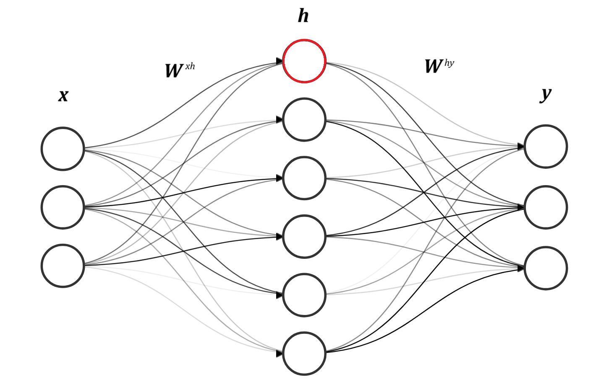

```{r}
#| label: DoNotModify
#| include: false
### Utilities. Do not modify.
# Installation of packages if necessary
install_packages <- function(packages) {
  install_package <- function(package) {
    if (!package %in% installed.packages()[, 1]) {
      install.packages(package, repos = "https://cran.rstudio.com/")
    }
  }
  invisible(sapply(packages, install_package))
}

# Basic packages
install_packages(c("bookdown", "formatR", "kableExtra", "ragg"))

# Chunk font size hook: allows size='small' or any valid Latex font size in chunk options
def.chunk.hook  <- knitr::knit_hooks$get("chunk")
knitr::knit_hooks$set(chunk = function(x, options) {
  x <- def.chunk.hook(x, options)
  ifelse(
    options$size != "normalsize", 
    paste0("\n \\", options$size,"\n\n", x, "\n\n \\normalsize"),
    x
  )
})
```

```{r}
#| label: Options
#| include: false
### Customized options for this document
# Add necessary packages here
packages <- c("tidyverse")
# Install them
install_packages(packages)

# knitr options
knitr::opts_chunk$set(
  cache =   FALSE,    # Cache chunk results
  include = TRUE,     # Show/Hide chunks
  echo =    TRUE,     # Show/Hide code
  warning = FALSE,    # Show/Hide warnings
  message = FALSE,    # Show/Hide messages
  # Figure alignment and size
  fig.align = 'center', out.width = '80%',
  # Graphic devices (ragg_png is better than standard png)
  dev = c("ragg_png", "pdf"),
  # Code chunk format
  tidy = TRUE, tidy.opts = list(blank = 
                                  FALSE, width.cutoff = 50),
  size = "scriptsize", knitr.graphics.auto_pdf = TRUE
  )
options(width = 50)

# ggplot style
library("tidyverse")
theme_set(theme_bw())
theme_update(
  panel.background = element_rect(fill = "transparent", colour = NA),
  plot.background = element_rect(fill = "transparent", colour = NA)
)
knitr::opts_chunk$set(dev.args = list(bg = "transparent"))


# Random seed
set.seed(973)
```

# Introduction

Artificial Neural Networks (ANN) are computational models inspired by the brain; made up of layers of interconnected "neurons" which can learn patterns when given large amounts of data. After learning patterns, ANNs can be used to make inferences, predicting an output based on some given input. ANNs have long been used for application ranging from computer vision to financial forecasting. However the use of ANNs has surged recently, increasing fourfold since 2017, driven by the development of generative AI models like ChatGPT [@StateAI2025]. To compound this, models are growing in size and becoming more complex, consequently the global AI power consumption is increasing at an exponential rate [@kindigAIPowerConsumption]. Not only does this make models expensive to operate, but it also raises sustainability concerns. 

A graphics processing unit (GPU) running a large language model (LLM) consumes hundreds of watts of power. On the other hand, the human brain processes sensory information, keeps involuntary biological systems functioning, runs its own language model, and enables conscious thought — all while using only about 20 watts. Such efficient information processing has motivated research into neuromorphic computing - a field aiming to emulate the brain’s neural architecture. Spiking Neural Networks (SNNs) are considered the third generation of neural network models [@maassNetworksSpikingNeurons1997], where ANNs are considered the second generation. Compared to neurons in ANNs, SNN neurons more closely model how biological neurons behave in the brain. For a second generation neuron, the output is a weighted sum of the inputs passed through an activation function (see Figure \@ref(fig:ann-vs-snn) (a)). For a third generation neuron, the output is a spike, sometimes referred to as an event, which occurs when the voltage of a neuron surpasses a threshold (Figure \@ref(fig:ann-vs-snn) (b)), this results in neurons communicating with each other via series of spikes, which vary in timing and frequency. Since information is encoded in the timing of outputs, SNNs can inherently capture temporal patterns and dynamic behaviours in sequential data, making them inherently capable at processing tasks involving time-dependent signals, such as speech recognition, sensory processing, and event-based data streams. Moreover, it has been shown that SNNs theoretically posses higher computational power than the previous generation of ANNs [@maassComputationalPowerCircuits2004]. Spiking neurons only activate when necessary, and don't require a clock signal, enabling massive power savings. For instance, the leading neuromorphic platform TrueNorth is capable of simulating a million spiking neurons in real-time while consuming 63 mW. The equivalent network executed on a high-performance computing platform was 100–200× slower than real-time and consumed 100,000 to 300,000× more energy per synaptic event [@merollaMillionSpikingneuronIntegrated2014]. The power savings of SNNs could be game-changing in edge computing devices that run on battery or have limited power budgets - like smartphones or remote environmental sensors. On top of this, their low-latency could benefit autonomous vehicles and robotics. 

{#fig:ann-vs-snn}

# Spiking Neuron Model

## Hodgkin–Huxley

The Hodgkin-Huxley neuron model developed in 1952 by Alan Hodgkin and Andrew Huxley, was the first to quantitatively explain how neurons generate and propagate electrical impulses, or action potentials, by describing the flow of sodium and potassium ions through voltage-gated channels.


## Leaky Integrate-and-Fire Neuron

The leaky integrate-and-fire (LIF) neuron model is the most widely used neuronal model in SNNs due to its simplicity and efficiency which helps it scale for larger networks. Simply put, the neuron receives spikes from "pre-synaptic" neurons (figure \@ref(fig:ann-vs-snn) (b)) - these are neurons which feed into the neuron in question; these spikes increase the "membrane potential" of the neuron - which is the voltage between the inside and outside of the neuron. When the membrane potential reaches a threshold voltage, the neuron in question fires a spike to the neurons that it is connected to, and it's membrane voltage resets to a baseline value. 

In order to be modelled computationally, this behaviour is expressed in mathematical terms. Spikes received by a neuron at time $t$ induce a current $X[t]$. This input current increases the membrane potential, $V[t]$, which is the voltage between the inside of the neuron and the outside. The voltage slowly decays over time, the speed of the decay depends on the membrane time constant, $\tau$. This is the "Leaky Integrate" aspect of the neuron; $X[t]$ is integrated to give $V[t]$ at the same time as $V[t]$ leaks voltage. The neuron leaks voltage till it reaches it's baseline voltage level, $V_{reset}$. This behaviour can be seen in equation (\ref{eqn:lif1}), $H[t]$ is equal equation (\ref{eqn:lif1})to $V[t]$, unless a spike occurs during $t$. This spiking logic is defined in equation (\ref{eqn:lif2}), where $\Theta(x)$ is a function that is $0$ unless $x\geq0$. In other words this function becomes 1 only when the threshold voltage $V_{th}$ is reached. When the threshold voltage is reached, $V[t]$ is set to $V_{reset}$ and a spike is released; if the threshold voltage is not reached then $V[t] = H[t]$. The membrane potential behaviour at spike time is defined in equation (\ref{eqn:lif3}).

\begin{equation}
H[t] = V[t-1] +\frac{1}{\tau}(X[t]-(V[t-1]-V_{reset})),
\label{eqn:lif1}
\end{equation}

\begin{equation}
S[t] = \Theta(H[t]-V_{th}),
\label{eqn:lif2}
\end{equation}

\begin{equation}
V[t]=H[t](1-S[t])+V_{reset}S[t]
\label{eqn:lif3}
\end{equation}

## Izhikevich

efficiently reproduces diverse spiking patterns with low computational cost


## Synapse Models


## Information coding 

In digital images, each pixel is stored as a number which represents the red, green, and blue light intensity at that point - a higher number indicates greater intensity of light. In digital audio, each timestep is encoded as a number which indicates the strength of the pressure perturbation at that particular time. So how can an image or audio be passed into a spiking neural network? In other words, how is it turned into spikes? Methods for coding information into spike trains can be classified into two groups - rate coding and temporal coding. A good place to start would be taking inspiration from the brain. Rate coding transfers information in the frequency of spikes at a given moment. Initially it was thought that rate coding was the predominant technique to transmit information within the nervous system [@adrianImpulsesProducedSensory1926], however 


# Training Neural Networks

The objective of training a neural network for spoken word recognition is to construct a model that accurately maps audio input to the correct lexical output. Supervised learning remains the dominant training paradigm in this domain, consistently achieving state-of-the-art results in speech recognition tasks [@dengMachineLearningParadigms2013; @hintonDeepNeuralNetworks2012]. Supervised learning relies on labelled datasets—typically composed of audio clips annotated with their corresponding transcriptions—providing explicit guidance for the model to learn the mapping between acoustic features and linguistic units. In contrast, unsupervised learning operates on unlabelled data, requiring the model to uncover inherent structure or patterns within the input without external annotation. Next I will discuss different ways that neural networks can be trained. 

## Backpropagation

Backpropagation is the most effective and widely used method for training second generation artificial neural networks. It provides a systematic way to adjust the internal parameters—or weights—of a network to minimize the discrepancy between the network’s predictions and the desired outputs. An overview of the backpropagation process is as follows:

1. Forward Pass: The model receives an input and processes it through its layers, generating an output.
2. Error Calculation: The output is compared to the desired target, and a loss function quantifies the error.
3. Gradient Computation: The derivative of the loss function is computed with respect to each weight in the network using the chain rule of calculus.
4. Weight Update: The weights are adjusted by subtracting a fraction of their corresponding gradient, typically scaled by a learning rate. This step moves the model toward a configuration that reduces error.

In supervised learning, the desired output is the label of the data. When a model predicts an output, the "loss" is calculated to quantify the error between the actual output and the desired output. For instance, a common way to calculate the loss is by calculating the mean squared error (MSE), where you find the sum of the squared differences between the actual output neuron values and the desired output neuron values (Equation (\ref{eqn:loss_mse})).

\begin{equation}
L= \frac{1}{n} \sum^{n}_{i=1}(y_{i}- \hat{y}_i​)^2
\label{eqn:loss_mse}
\end{equation}

To demonstrate how backpropagation works, let's consider this simplified, fully-connected network consisting of a layer of input neurons, hidden neurons, and output neurons (Figure \@ref(fig:mlp_3_layer)). Fully-connected means each neuron in a layer is connected to all neurons in the following layer. 


{#fig:mlp_3_layer fig-align=center}

The highlighted neuron, $h_{1}$, is connected to all input neurons, $x_{1}$, $x_{2}$, and $x_{3}$. This means $h_{1}$ is a weighted sum of the input neurons, $x$ (Equation \ref{eqn:weighted_sum}).  

\begin{equation}
h_{1} = \sum_{i=1}^{3} x_{i}\times W_{i}^{1}
\label{eqn:weighted_sum}
\end{equation}

An efficient way to write these weighted summations for all of the neurons in a layer is by using matrix algebra. 

$$h = x\times W^{'}$$
$$y = h\times W^{''}$$

The relationship between the equation \ref{eqn:weighted_sum} and the matrix multiplication representation of the network is highlighted in figure \@ref(fig:matrix_of_network).

{#fig:matrix_of_network fig-align=center}

To train the network and adjust the weights, we perform inference on labelled data and calculate the error using a loss function $l()$, such as mean squared error (MSE):

\begin{equation}
L = l(y, y_{\text{label}})
\end{equation}

The goal is to minimize this loss by updating the network's weights in the direction of the negative gradient. This requires computing the gradient of the loss with respect to each weight $w_i$:

\begin{equation}
\frac{\partial L}{\partial w_i}
\end{equation}

We first calculate the gradient of the layer closest to the output, $W^{''}$.

\begin{equation}
\frac{\partial L}{\partial W^{''}} = \frac{\partial L}{\partial y} \cdot \frac{\partial y}{\partial W^{''}} = \frac{\partial L}{\partial y} \cdot h
\end{equation}

We then use the chain rule again to calculate the gradient of $L$ with respect to $W^{'}$.

\begin{equation}
\frac{\partial L}{\partial W^{'}} = \frac{\partial L}{\partial y} \cdot \frac{\partial y}{\partial h} \cdot \frac{\partial h}{\partial W^{'}} = \frac{\partial L}{\partial y} \cdot W^{''} \cdot x
\end{equation}

This step-by-step application of the chain rule allows the error to be propagated backward through the network, enabling efficient computation of gradients at each layer—this is the essence of backpropagation.

Once the gradients are known, the weights are updated using the gradient descent rule:

\begin{equation}
w_i \leftarrow w_i - \eta \frac{\partial L}{\partial w_i}
\end{equation}

where $\eta$ is the learning rate. Repeating this process across many training examples allows the network to gradually learn the desired input-output mapping.

This iterative optimization nudges the network toward improved accuracy, ensuring better alignment between predictions and target values over multiple training cycles. The problem with applying this algorithm to SNNs is that spike events are non-differentiable, therefore the gradient network cannot be calculated and the weights cannot be adjusted. So how are SNNs trained?

## ANN-to-SNN Conversion

Due to the popularity of ANNs, literature on training them is advanced, so a natural and popular choice for training SNNs has been by converting a trained ANN model into an SNN model. Usually a trained artificial neural network is transformed into a spiking neural network by substituting ReLU activation functions with spiking neuron models. This process often involves additional adjustments such as weight normalization and threshold balancing to maintain performance and stability. These ways of training have had good results for some tests [@wuDeepSpikingNeural2020; @bittarSurrogateGradientSpiking2022]. However, such a method incurs large computational costs during conversion and is limited by the architecture of ANNs which are less adaptable to dynamic data like audio [@bellecBiologicallyInspiredAlternatives2019]. Thus, to fully harness the benefits of SNNs — from energy efficiency to novel architectures — effective direct training methods are essential. 
 
### BPTT + SG

Backpropagation‑through‑time (BPTT) with surrogate gradients provides a way to train spiking neural networks (SNNs) on sequences like speech by adapting familiar gradient‑based methods to the spiking behavior of neurons. In plain terms, you can think of the network’s activity over time as a very deep chain of simple processing steps; BPTT “unrolls” this chain so that the error at the end can be traced back step by step to adjust every connection [@neftciSurrogateGradientLearning2019]. Because a spike is a discontinuous event (it either happens or it doesn’t), we replace its true derivative—which is zero almost everywhere and jumps to infinity at spike times—with a smooth “surrogate” function during training. This surrogate lets us compute approximate gradients so that standard optimisers like gradient descent can still work [@bellecBiologicallyInspiredAlternatives2019].

When applied to speech‑recognition benchmarks—such as the Spiking Speech Commands (SSC) and Spiking Heidelberg Digits (SHD) datasets—this method achieves accuracy on par with conventional neural networks while operating in a sparse, event‑driven fashion that can be more energy‑efficient at inference time [@bittarSurrogateGradientSpiking2022; @zhouDirectTrainingHighperformance2024]. Researchers have even swapped out recurrent layers in end‑to‑end speech models for SG‑trained spiking modules, showing only small drops in word‑error rate and offering a path toward low‑power, real‑time processing [@bittarSurrogateGradientSpiking2022].

However, BPTT + SG comes with two major downsides. First, it requires storing every intermediate state over the entire duration of an input—meaning memory usage grows with the length of the audio clip, which can quickly exceed hardware limits for long recordings [@zhouDirectTrainingHighperformance2024]. Second, because the learning rule relies on a global error signal propagated across many time steps and layers, it differs starkly from the local, synapse‑by‑synapse learning observed in biological brains—undermining some of the potential efficiency gains of neuromorphic hardware [@wangS3NNTimStep2022]. 

### Eligibility propagation

Eligibility propagation, or e‑prop, is a method for training spiking neural networks (SNNs) that aligns more closely with how learning is believed to occur in the brain. Unlike traditional training methods like backpropagation‑through‑time (BPTT), which require storing the entire history of neuron activities and propagating errors backward through time, e‑prop simplifies this process by using two key components: eligibility traces and a learning signal. Eligibility traces act like short‑term memories at each synapse, recording recent activity patterns. They capture how the timing of spikes affects the potential for learning. The learning signal is a global factor that represents the overall error or feedback from the network's output. Instead of sending detailed error information back through every layer and time step, as in BPTT, e‑prop uses this single signal to modulate the eligibility traces. When the network makes a mistake, the learning signal adjusts the synapses with high eligibility traces, effectively correcting the connections that contributed most to the error.​ 
By updating synaptic weights immediately based on recent pre‑ and post‑synaptic activity, e‑prop reduces memory requirements compared to BPTT [@bellecEligibilityTracesProvide2019] and can dramatically lower energy consumption on event‑driven hardware [@bellecEligibilityTracesProvide2019a][@rostamiEpropSpiNNaker22022]. However, because it uses approximate gradients, e‑prop–trained models typically exhibit lower accuracy than fully BPTT‑trained networks, reflecting a trade‑off between biological plausibility and performance.

In its original demonstration, Bellec et al. applied e‑prop to train spiking recurrent networks on the TIMIT speech corpus, showing that eligibility traces derived from slow neuronal dynamics could capture phonetic temporal dependencies without backward passes [@bellecEligibilityTracesProvide2019]. Subsequent work has enriched e‑prop with spike‑timing–dependent plasticity (STDP)–like eligibility decay and local random broadcast alignment to improve phoneme classification accuracy. Van der Veen demonstrated that modulating eligibility traces according to precise spike timing and using randomized local error broadcasts allowed spiking networks to approach conventional LSTM performance on phonetic labels, all while preserving the sparse activity characteristic of SNNs [@veenIncludingSTDPEligibility2021].

E‑prop has been implemented on neuromorphic hardware for keyword spotting. On the SpiNNaker 2 system, Frenkel and Indiveri trained spiking recurrent networks on the Google Speech Commands dataset, achieving over 91 % accuracy with only 680 KB of training memory—over 12× lower energy consumption than GPU‑based BPTT solutions [@rostamiEpropSpiNNaker22022a]. 

Despite its advantages, e‑prop also has notable drawbacks. First, it requires maintaining multiple eligibility traces per synapse (e.g., for membrane potential and adaptive threshold), as well as optimizer state such as moment vectors, resulting in significant memory overhead for large networks [@rostamiEpropSpiNNaker22022; @turn0search8]. Second, because it employs approximate surrogate gradients rather than true backpropagation, e‑prop–trained models typically achieve lower accuracy than their BPTT‑trained counterparts [@bellecEligibilityTracesProvide2019]. Third, although e‑prop avoids backward error propagation through time, it still depends on a global learning signal to modulate local eligibility traces, introducing communication overhead and deviating from strictly local synaptic updates—factors that can limit its energy efficiency on distributed neuromorphic hardware [@bellecEligibilityTracesProvide2019a]. 

### Memristor based STDP

Spike‑timing‑dependent plasticity (STDP) is a biological learning rule that adjusts the strength of synaptic connections according to the precise timing of spikes: if a presynaptic neuron fires just before a postsynaptic neuron, the connection is strengthened; if the order is reversed, it is weakened. This temporally sensitive form of Hebbian learning—often summarized as “cells that fire together, wire together”—operates locally at each synapse and does not require global error signals, making it inherently biologically plausible, asynchronous, and capable of unsupervised learning.

{#fig:stdp_ltp_ltd fig-align=center}

Memristors are two‑terminal devices whose conductance changes based on the history of voltage or current, closely mimicking how biological synapses adjust their efficacy [@chenEssentialCharacteristicsMemristors2023]. In memristor‑based STDP, each memristor stores a synaptic weight in its conductance, and weight updates occur directly on‑chip whenever spikes arrive, following the device’s own switching dynamics [@liResearchProgressNeural2023]. By collocating memory and computation, this approach avoids the von Neumann bottleneck and enables energy‑efficient, on‑device learning in neuromorphic hardware [@weilenmannSingleNeuromorphicMemristor2024].

Vlasov et al. (2022) demonstrated this concept on a spoken‑digit recognition task by training spiking neural networks with memristor‑based STDP using two memristor types—poly‑p‑xylylene (PPX) and CoFeB–LiNbO₃ nanocomposite [@vlasovSpokenDigitsClassification2022]. Their networks, deployed entirely on neuromorphic hardware, achieved classification accuracies between 80 % and 94 % depending on network topology and decoding strategy, rivaling more complex off‑chip learning algorithms while consuming minimal power and memory [@sboevSpokenDigitsClassification2024]. 

### Parallelizable LIF

A major bottleneck in training spiking neural networks (SNNs) is the strictly sequential nature of classic Leaky Integrate‑and‑Fire (LIF) neurons, which update their membrane potential step by step in time. The Parallelizable LIF (ParaLIF) model overcomes this by decoupling the linear integration of inputs from the spiking (thresholding) operation and executing both across all time steps in parallel. This reorganization leverages highly optimized matrix operations on modern accelerators to deliver dramatic speed‑ups in training, without altering the fundamental membrane‑and‑spike dynamics that give SNNs their event‑driven efficiency [@arnaudyargaAcceleratingSpikingNeural2025; @yargaAcceleratingSNN2023].

{#fig:parallel_lif fig-align=center}

In a standard LIF neuron, the membrane potential $V(t)$ at time $t$ depends on its previous value $V(t−1)$ plus any new inputs, and a spike is emitted once $V$ crosses a threshold. ParaLIF rewrites this process as two separate GPU kernels. The first kernel computes, for every neuron, the entire sequence of membrane‑potential updates in one batched matrix multiplication; the second applies the threshold‐and‐reset rule simultaneously at all time points. By removing the need for “time‑step loops,” ParaLIF converts a fundamentally serial simulation into a fully vectorized parallel computation [@arnaudyargaAcceleratingSpikingNeural2025].

When benchmarked on neuromorphic speech (Spiking Heidelberg Digits), image and gesture datasets, ParaLIF achieves up to 200× faster training than conventional LIF models, while matching or exceeding their accuracy with comparable levels of sparsity [@arnaudyargaAcceleratingSpikingNeural2025; @yargaAcceleratingSNN2023]. Compared to other parallel schemes—such as the Stochastic Parallelizable Spiking Neuron (SPSN) approach—ParaLIF maintains similar speed‑ups on short sequences and far greater scalability on very long inputs [@yargaAcceleratingSNN2023].

By reorganizing the time dimension, ParaLIF departs from the continuous, step‑by‑step integration that real neurons exhibit, reducing its biological plausibility [@maassNetworksOfSpiking1997]. This parallel update can also undermine the network’s ability to capture fine temporal dependencies, since precise spike timing and sequential context are approximated rather than explicitly modeled [@exploringLimitationsLayerSynchronization2024; @SpikingSSM2024]. Finally, the specialized GPU kernels and data‑layout transformations needed for ParaLIF introduce implementation complexity and may not map efficiently to more constrained neuromorphic hardware, limiting its applicability in low‑power edge scenarios [@resonateAndFireOpenReview; @ZhouZhang2021].

### Eventprop
A novel training algorithm which utilises precise spike gradients to train the network. Eventprop computes gradients in a more efficient manner than BPTT. It reaches SOTA performance while using 4x less memory and running 3x faster. [@nowotnyLossShapingEnhances2025]


SNNs have inherent temporal dependence and show promise for efficiently processing time-based data. 


# Problem To Solve

Spiking neural networks are inherently time dependent since information is encoded in the timing of spikes. This makes them naturally applicable for temporal tasks - tasks where the data evolves with time. Artificial neural networks can be tweaked to deal with temporal data of unspecified duration by introducing recurrence. Temporal data can come in many forms, for instance stock market information, video, or audio. This contrasts to static datasets where data is a single block and not related to other samples temporally, for instance image classification, pattern recognition, large language models. The efficiency and potential effectiveness of SNNs to process temporal information could be game changing in edge devices such as mobile phones, wearable devices, and remote sensors which have small power budgets. Large language models are revolutionising how we interact with computers, they provide a way humans to interface with machines using natural language. As a result, companies are eagerly integrating LLMs into their products and services - e.g. Siri, Raybans. Speech recognition is therefore a type of temporal data which is highly relevant and potentially game changing. 

# Spiking Heidelberg Digits Dataset

The Spiking Heidelberg Digits (SHD) dataset is a prominent spiking neural network benchmark. The wide use of SHD makes it good for fairly comparing different methods of training models. It is based on the Heidelberg Digits dataset, which is a collection of 10,000 high-quality recordings of spoken digits (0 to 9) in English and German. It is spoken by a relatively representative group of 6 males and 6 females of the ages 21 to 56 years old, with a mean age of 29. The HD dataset was converted into spike trains using a biologically realistic model of the cochlea, outputting 700 channels of spikes. It is a more challenging benchmark than MNIST which is nearing saturation. Moreover it is less computationally intensive than a visual dataset like DVS128 - which has recordings of gestures. 

# Model Description 

The model uses Leaky Integrate-and-Fire neuron model with exponential synapses. It has an input layer of 700 neurons - corresponding to the 700 channels of the cochlea model used by SHD - and 20 output neurons for digits 0 to 9 in English and German. The model has a single hidden layer which has been tested with a size of 64, 128, 256, 512, and 1024. The hidden layer was tested using feed-forward only connections and fully connected recurrent connections, showing best results with a recurrent architecture.


# Training Process

The input is provided into the model and it is allowed to develop under neuronal dynamics. The loss is calculated according to Equation (\ref{eqn:lsumexp}). Using the adjoint method the loss is propagated backwards to find out how the timing of each event contributed to the loss so that the weights of the synapses can be adjusted accordingly.  

\begin{equation}
\mathcal{L}_{sum-exp} = -\frac{1}{N_{batch}} \sum^{N_{bathc}}_{m=1}log(\frac{exp(\int^{T}_{0} e^{-t/T}V^{m}_{l(m)}(t) dt )}{\sum^{N_{out}}_{k=1}exp(\int^{T}_{0}e^{-t/T}V^{m}_{k}(t) dt)})
\label{eqn:lsumexp}
\end{equation}

This loss was chosen as it deals with the problem highlighted by the Gedanken Experiment. 

