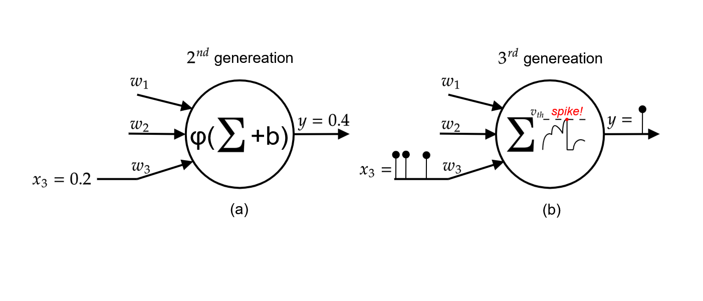

```{r}
#| label: DoNotModify
#| include: false
### Utilities. Do not modify.
# Installation of packages if necessary
install_packages <- function(packages) {
  install_package <- function(package) {
    if (!package %in% installed.packages()[, 1]) {
      install.packages(package, repos = "https://cran.rstudio.com/")
    }
  }
  invisible(sapply(packages, install_package))
}

# Basic packages
install_packages(c("bookdown", "formatR", "kableExtra", "ragg"))

# Chunk font size hook: allows size='small' or any valid Latex font size in chunk options
def.chunk.hook  <- knitr::knit_hooks$get("chunk")
knitr::knit_hooks$set(chunk = function(x, options) {
  x <- def.chunk.hook(x, options)
  ifelse(
    options$size != "normalsize", 
    paste0("\n \\", options$size,"\n\n", x, "\n\n \\normalsize"),
    x
  )
})
```

```{r}
#| label: Options
#| include: false
### Customized options for this document
# Add necessary packages here
packages <- c("tidyverse")
# Install them
install_packages(packages)

# knitr options
knitr::opts_chunk$set(
  cache =   FALSE,    # Cache chunk results
  include = TRUE,     # Show/Hide chunks
  echo =    TRUE,     # Show/Hide code
  warning = FALSE,    # Show/Hide warnings
  message = FALSE,    # Show/Hide messages
  # Figure alignment and size
  fig.align = 'center', out.width = '80%',
  # Graphic devices (ragg_png is better than standard png)
  dev = c("ragg_png", "pdf"),
  # Code chunk format
  tidy = TRUE, tidy.opts = list(blank = 
                                  FALSE, width.cutoff = 50),
  size = "scriptsize", knitr.graphics.auto_pdf = TRUE
  )
options(width = 50)

# ggplot style
library("tidyverse")
theme_set(theme_bw())
theme_update(
  panel.background = element_rect(fill = "transparent", colour = NA),
  plot.background = element_rect(fill = "transparent", colour = NA)
)
knitr::opts_chunk$set(dev.args = list(bg = "transparent"))

# Random seed
set.seed(973)
```

# Introduction

Artificial Neural Networks (ANN) are computational models inspired by the brain; made up of layers of interconnected "neurons" which can learn patterns when given large amounts of data. After learning patterns, ANNs can be used to make inferences, predicting an output based on some given input. ANNs have long been used for application ranging from computer vision to financial forecasting. However the use of ANNs has surged recently, increasing fourfold since 2017, driven by the development of generative AI models like ChatGPT [@StateAI2025]. To compound this, models are growing in size and becoming more complex, consequently the global AI power consumption is increasing at an exponential rate [@kindigAIPowerConsumption]. Not only does this make models expensive to operate, but it also raises sustainability concerns. 

A graphics processing unit (GPU) running a large language model (LLM) consumes hundreds of watts of power. On the other hand, the human brain processes sensory information, keeps involuntary biological systems functioning, runs its own language model, and enables conscious thought — all while using only about 20 watts. Such efficient information processing has motivated research into neuromorphic computing - a field aiming to emulate the brain’s neural architecture. Spiking Neural Networks (SNNs) are considered the third generation of neural network models [@maassNetworksSpikingNeurons1997], where ANNs are considered the second generation. Compared to neurons in ANNs, SNN neurons more closely model how biological neurons behave in the brain. For a second generation neuron, the output is a weighted sum of the inputs passed through an activation function (see Figure \@ref(fig:my-image) (a)). For a third generation neuron, the output is a spike, sometimes referred to as an event, which occurs when the voltage of a neuron surpasses a threshold (Figure \@ref(fig:my-image) (b)), this results in neurons communicating with each other via series of spikes, which vary in timing and frequency. Since information is encoded in the timing of outputs, SNNs can inherently capture temporal patterns and dynamic behaviours in sequential data, making them inherently capable at processing tasks involving time-dependent signals, such as speech recognition, sensory processing, and event-based data streams. Moreover, it has been shown that SNNs theoretically posses higher computational power than the previous generation of ANNs [@maassComputationalPowerCircuits2004]. Spiking neurons only activate when necessary, and don't require a clock signal, enabling massive power savings. For instance, the leading neuromorphic platform TrueNorth is capable of simulating a million spiking neurons in real-time while consuming 63 mW. The equivalent network executed on a high-performance computing platform was 100–200× slower than real-time and consumed 100,000 to 300,000× more energy per synaptic event [@merollaMillionSpikingneuronIntegrated2014]. The power savings of SNNs could be game-changing in edge computing devices that run on battery or have limited power budgets - like smartphones or remote environmental sensors. On top of this, their low-latency could benefit autonomous vehicles and robotics. (Benefit of being more explainable?)



# Spiking Neuron Model

The leaky integrate-and-fire (LIF) neuron model is the most widely used neuronal model in SNNs due to its simplicity and efficiency which helps it scale for larger networks. The neuron receives weighted spiking inputs from other neurons as can be seen in figure \@ref(fig:my-image) (b). Spikes received by a neuron at time $t$ induce a current $X[t]$. This input current increases the membrane potential, $V[t]$, which is the voltage between the inside of the neuron and the outside. The voltage slowly decays over time, the speed of the decay depends on the membrane time constant, $\tau$. This is the "Leaky Integrate" aspect of the neuron; $X[t]$ is integrated to give $V[t]$ at the same time as $V[t]$ leaks voltage. The neuron leaks voltage till it reaches it's baseline voltage level, $V_{reset}$. This behaviour can be seen in equation (\ref{eqn:lif1}), $H[t]$ is equal equation (\ref{eqn:lif1})to $V[t]$, unless a spike occurs during $t$. This spiking logic is defined in equation (\ref{eqn:lif2}), where $\Theta(x)$ is a function that is $0$ unless $x\geq0$. In other words this function becomes 1 only when the threshold voltage $V_{th}$ is reached. When the threshold voltage is reached, $V[t]$ is set to $V_{reset}$ and a spike is released; if the threshold voltage is not reached then $V[t] = H[t]$. The membrane potential behaviour at spike time is defined in equation (\ref{eqn:lif3}).

\begin{equation}
H[t] = V[t-1] +\frac{1}{\tau}(X[t]-(V[t-1]-V_{reset})),
\label{eqn:lif1}
\end{equation}

\begin{equation}
S[t] = \Theta(H[t]-V_{th}),
\label{eqn:lif2}
\end{equation}

\begin{equation}
V[t]=H[t](1-S[t])+V_{reset}S[t]
\label{eqn:lif3}
\end{equation}

Synapse Models


---

Literature discussing different parameters to adjust: firing threshold [@wangLTMDLearningImprovement2022], membrane time constant [@fangIncorporatingLearnableMembrane2021a], weights [@rathiDIETSNNLowLatencySpiking2023], activation function between charging and firing [@jiangKLIFOptimizedSpiking2023].

--- 

Other models of neurons include:
**Parallel Spiking neuron model**: [@arnaudyargaAcceleratingSpikingNeural2025]

**Izhikevich** – efficiently reproduces diverse spiking patterns with low computational cost;  
**Hodgkin–Huxley** – offers high biophysical accuracy but is computationally intensive.

--- 

Todo: Information coding 
In digital images, each pixel is stored as a number which represents the red, green, and blue light intensity at that point - a higher number indicates greater intensity of light. In digital audio, each timestep is encoded as a number which indicates the strength of the pressure perturbation at that particular time. So how can an image or audio be passed into a spiking neural network? In other words, how is it turned into spikes? Methods for coding information into spike trains can be classified into two groups - rate coding and temporal coding. A good place to start would be taking inspiration from the brain. Rate coding transfers information in the frequency of spikes at a given moment. Initially it was thought that rate coding was the predominant technique to transmit information within the nervous system [@adrianImpulsesProducedSensory1926], however 


---

Todo: Why I will focus on audio data.

# Training Neural Networks

## Backpropagation

Backpropagation is the most widely used and effective method for training second generation artificial neural networks. It operates by iteratively adjusting the network's weights to minimize error. The process follows these key steps:

1. **Forward Pass**: The model receives an input and processes it through its layers, generating an output.
2. **Error Calculation**: The output is compared to the desired target, and a **loss function** quantifies the error.
3. **Gradient Computation**: The derivative of the loss function is computed with respect to each weight in the network using the **chain rule of calculus**.
4. **Weight Update**: The weights are adjusted by subtracting a fraction of their corresponding gradient, typically scaled by a learning rate. This step moves the model toward a configuration that reduces error.

This iterative optimization nudges the network toward improved accuracy, ensuring better alignment between predictions and target values over multiple training cycles. The problem with applying this algorithm to SNNs is that spike events are non-differentiable, therefore the gradient network cannot be calculated and the weights cannot be adjusted. So how are SNNs trained?

## ANN-to-SNN Conversion

Due to the popularity of ANNs, literature on training them is quite advanced, so a natural and popular choice for training SNNs has been by converting a trained ANN model into an SNN model. Such ways of training have had good results for some tests, however such a method incurs large computational costs during conversion and is limited by the architecture of ANNs which are less adaptable to dynamic data [@bellecBiologicallyInspiredAlternatives2019]. Thus, to fully harness the benefits of SNNs — from energy efficiency to novel architectures — effective direct training methods are essential. 


## Direct Training 

There are several approaches to directly training SNNS. 
### Local learning rules

Local learning rules 
- Biologically feasible 
- Asynchronous unsupervised learning
- More efficient learning using spiking behaviours

Memristor based STDP is an algorithm which is tailored to neuromorphic hardware - taking advantage of memristor behaviours. It uses local learning rules and is deployable on neuromorphic devices. [@SpokenDigitsClassification]

### BPTT + SG
- A very prominent method for directly training SNNs
- SG used to approximate the gradient 
- Does well on static datasets
- Needs a ton of memory [@zhouDirectTrainingHighperformance2024]
The most prominent approach is backpropagation-through-time (BPTT), often paired with the surrogate gradient (SG) method. Since spikes are inherently non-differentiable, SG provides an approximation of their gradients, enabling the use of BPTT to optimize the model’s parameters. This combination has become a prominent approach for training SNNs, allowing models to learn from temporal data and allowing further exploration of novel SNN architectures. However, BPTT is not considered a biologically plausible learning method, as neurons in the brain are believed to learn using local information [@zhouDirectTrainingHighperformance2024] — that is, signals received directly from neighbouring neurons. As a result, BPTT may not fully leverage the efficiencies observed in biological systems. For example, implementing local learning rules could reduce data movement across the chip, potentially enhancing energy efficiency. 

### e-prop
An interesting approach. BPTT is biologically implausible as it requires storage of past neuron states and propagating errors backwards. Moreover, e-prop facilitates online real-time learning. Also e-prop requires far less energy than BPTT. 
Though it has it's advantages, models trained using e-prop aren't as accurate as BPTT. [@bellecBiologicallyInspiredAlternatives2019]

### Parallelizable LIF
Neuron spike events are sequential 

### Eventprop
A novel training algorithm which utilises precise spike gradients to train the network. Eventprop computes gradients in a more efficient manner than BPTT. It reaches SOTA performance while using 4x less memory and running 3x faster. [@nowotnyLossShapingEnhances2025]


Information about the experiments: 
1) Problem to solve (learning spoken digits.. further details - language etc)
2) Dataset used: how many datapoints for training, cross-validation, testing etc.
3) Model description: network size, layers, recurrent/feedforward, neuron model, synapse model etc.
4) Training process: method used, performance (plots for accuracy vs time for training, cross-val, testing)


SNNs have inherent temporal dependence and show promise for efficiently processing time-based data. 


# Problem To Solve

Spiking neural networks are inherently time dependent since information is encoded in the timing of spikes. This makes them naturally applicable for temporal tasks - tasks where the data evolves with time. Artificial neural networks can be tweaked to deal with temporal data of unspecified duration by introducing recurrence. Temporal data can come in many forms, for instance stock market information, video, or audio. This contrasts to static datasets where data is a single block and not related to other samples temporally, for instance image classification, pattern recognition, large language models. The efficiency and potential effectiveness of SNNs to process temporal information could be game changing in edge devices such as mobile phones, wearable devices, and remote sensors which have small power budgets. Large language models are revolutionising how we interact with computers, they provide a way humans to interface with machines using natural language. As a result, companies are eagerly integrating LLMs into their products and services - e.g. Siri, Raybans. Speech recognition is therefore a type of temporal data which is highly relevant and potentially game changing. 

# Spiking Heidelberg Digits Dataset

The Spiking Heidelberg Digits (SHD) dataset is a prominent spiking neural network benchmark. The wide use of SHD makes it good for fairly comparing different methods of training models. It is based on the Heidelberg Digits dataset, which is a collection of 10,000 high-quality recordings of spoken digits (0 to 9) in English and German. It is spoken by a relatively representative group of 6 males and 6 females of the ages 21 to 56 years old, with a mean age of 29. The HD dataset was converted into spike trains using a biologically realistic model of the cochlea, outputting 700 channels of spikes. It is a more challenging benchmark than MNIST which is nearing saturation. Moreover it is less computationally intensive than a visual dataset like DVS128 - which has recordings of gestures. 

# Model Description 

The model uses Leaky Integrate-and-Fire neuron model with exponential synapses. It has an input layer of 700 neurons - corresponding to the 700 channels of the cochlea model used by SHD - and 20 output neurons for digits 0 to 9 in English and German. The model has a single hidden layer which has been tested with a size of 64, 128, 256, 512, and 1024. The hidden layer was tested using feed-forward only connections and fully connected recurrent connections, showing best results with a recurrent architecture.


# Training Process

The input is provided into the model and it is allowed to develop under neuronal dynamics. The loss is calculated according to Equation (\ref{eqn:lsumexp}). Using the adjoint method the loss is propagated backwards to find out how the timing of each event contributed to the loss so that the weights of the synapses can be adjusted accordingly.  

\begin{equation}
\mathcal{L}_{sum-exp} = -\frac{1}{N_{batch}} \sum^{N_{bathc}}_{m=1}log(\frac{exp(\int^{T}_{0} e^{-t/T}V^{m}_{l(m)}(t) dt )}{\sum^{N_{out}}_{k=1}exp(\int^{T}_{0}e^{-t/T}V^{m}_{k}(t) dt)})
\label{eqn:lsumexp}
\end{equation}

This loss was chosen as it deals with the problem highlighted by the Gedanken Experiment. 

