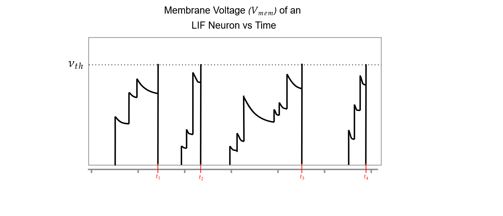
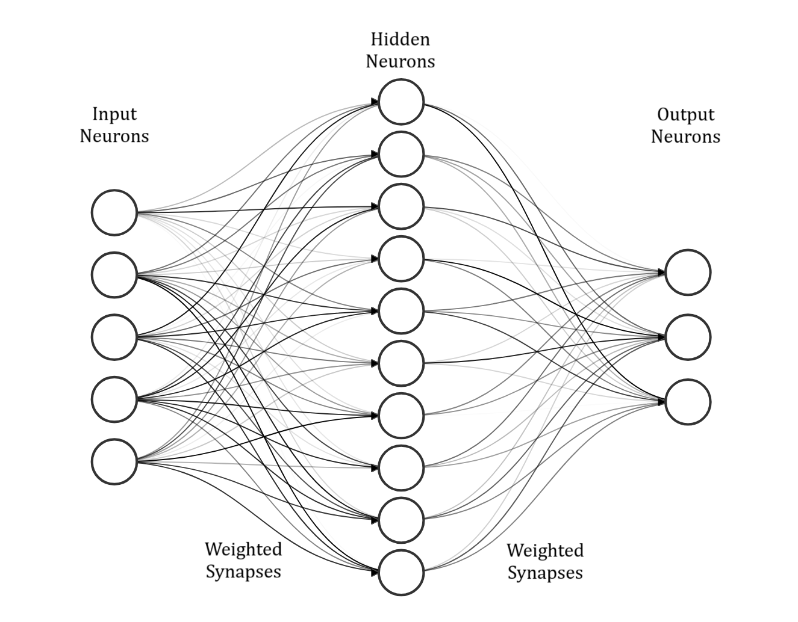

```{r}
#| label: DoNotModify
#| include: false
### Utilities. Do not modify.
# Installation of packages if necessary
install_packages <- function(packages) {
  install_package <- function(package) {
    if (!package %in% installed.packages()[, 1]) {
      install.packages(package, repos = "https://cran.rstudio.com/")
    }
  }
  invisible(sapply(packages, install_package))
}

# Basic packages
install_packages(c("bookdown", "formatR", "kableExtra", "ragg"))

# Chunk font size hook: allows size='small' or any valid Latex font size in chunk options
def.chunk.hook  <- knitr::knit_hooks$get("chunk")
knitr::knit_hooks$set(chunk = function(x, options) {
  x <- def.chunk.hook(x, options)
  ifelse(
    options$size != "normalsize", 
    paste0("\n \\", options$size,"\n\n", x, "\n\n \\normalsize"),
    x
  )
})
```

```{r}
#| label: Options
#| include: false
### Customized options for this document
# Add necessary packages here
packages <- c("tidyverse")
# Install them
install_packages(packages)

# knitr options
knitr::opts_chunk$set(
  cache =   FALSE,    # Cache chunk results
  include = TRUE,     # Show/Hide chunks
  echo =    TRUE,     # Show/Hide code
  warning = FALSE,    # Show/Hide warnings
  message = FALSE,    # Show/Hide messages
  # Figure alignment and size
  fig.align = 'center', out.width = '80%',
  # Graphic devices (ragg_png is better than standard png)
  dev = c("ragg_png", "pdf"),
  # Code chunk format
  tidy = TRUE, tidy.opts = list(blank = 
                                  FALSE, width.cutoff = 50),
  size = "scriptsize", knitr.graphics.auto_pdf = TRUE
  )
options(width = 50)

# ggplot style
library("tidyverse")
theme_set(theme_bw())
theme_update(
  panel.background = element_rect(fill = "transparent", colour = NA),
  plot.background = element_rect(fill = "transparent", colour = NA)
)
knitr::opts_chunk$set(dev.args = list(bg = "transparent"))


# Random seed
set.seed(973)
```

# Introduction

Artificial Neural Networks (ANN) are computational models inspired by the brain; made up of layers of interconnected "neurons" which can learn patterns when given large amounts of data. After learning patterns, ANNs can be used to make inferences, predicting an output based on some given input. ANNs have long been used for application ranging from computer vision to financial forecasting. However the use of ANNs has surged recently, increasing fourfold since 2017, driven by the development of generative AI models like ChatGPT [@StateAI2025]. To compound this, models are growing in size and becoming more complex, consequently the global AI power consumption is increasing at an exponential rate [@kindigAIPowerConsumption]. Not only does this make models expensive to operate, but it also raises sustainability concerns. 

A graphics processing unit (GPU) running a large language model (LLM) consumes hundreds of watts of power. On the other hand, the human brain processes sensory information, keeps involuntary biological systems functioning, runs its own language model, and enables conscious thought — all while using only about 20 watts. Such efficient information processing has motivated research into neuromorphic computing - a field aiming to emulate the brain’s neural architecture. Spiking Neural Networks (SNNs) are considered the third generation of neural network models [@maassNetworksSpikingNeurons1997], where ANNs are considered the second generation. Compared to neurons in ANNs, SNN neurons more closely model how biological neurons behave in the brain. For a second generation neuron, the output is a weighted sum of the inputs passed through an activation function (see Figure \ref{fig:second_vs_third_gen} (a)). For a third generation neuron, the output is a spike, sometimes referred to as an event, which occurs when the voltage of a neuron surpasses a threshold (Figure \ref{fig:second_vs_third_gen} (b)), this results in neurons communicating with each other via series of spikes, which vary in timing and frequency. Since information is encoded in the timing of outputs, SNNs can inherently capture temporal patterns and dynamic behaviours in sequential data, making them inherently capable at processing tasks involving time-dependent signals, such as speech recognition, sensory processing, and event-based data streams. Moreover, it has been shown that SNNs theoretically posses higher computational power than the previous generation of ANNs [@maassComputationalPowerCircuits2004]. Spiking neurons only activate when necessary, and don't require a clock signal, enabling massive power savings. For instance, the leading neuromorphic platform TrueNorth is capable of simulating a million spiking neurons in real-time while consuming 63 mW. The equivalent network executed on a high-performance computing platform was 100–200× slower than real-time and consumed 100,000 to 300,000× more energy per synaptic event [@merollaMillionSpikingneuronIntegrated2014]. The power savings of SNNs could be game-changing in edge computing devices that run on battery or have limited power budgets - like smartphones or remote environmental sensors. On top of this, their low-latency could benefit autonomous vehicles and robotics. 


{#fig:second_vs_third_gen fig-align=center}


## Problem to Solve

Spiking neural networks are inherently time dependent since information is encoded in the timing of spikes. This makes them naturally capable of being applied to temporal tasks - tasks where the data evolves with time. The problem with using ANNs for temporal data is that they require a fixed input size. Though they can be tweaked to deal with unspecified length temporal data using a paradigm called "recurrence", this comes with it's downsides, such as expensive training and large memory use [citation needed]. Temporal data can come in many forms, for instance video, audio, or even stock market information. The efficiency and potential effectiveness of SNNs to process temporal information could be game changing in edge devices such as mobile phones, wearable devices, and remote sensors which have small power budgets. Large language models are revolutionising how we interact with computers, they provide a way humans to interface with machines using natural language. As a result, companies are eagerly integrating LLMs into their products and services - e.g. Siri, Raybans [citation needed]. Accurate speech recognition is therefore posing to be a highly relevant application of SNNs, playing into their strengths of temporal processing and energy efficiency. 

## Spiking Heidelberg Digits Dataset

The Spiking Heidelberg Digits (SHD) dataset [citation needed] is a prominent spiking neural network benchmark. The wide use of SHD makes it good for fairly comparing different methods of training models. It is based on the Heidelberg Digits dataset, which is a collection of 10,000 high-quality recordings of spoken digits (0 to 9) in English and German. It is spoken by a relatively representative group of 6 males and 6 females of the ages 21 to 56 years old, with a mean age of 29. The HD dataset was converted into spike trains using a biologically realistic model of the human cochlea, outputting 700 channels of spikes representing different frequency bands picked up by the ear.

[How are spikes encoded. Temporal or rate?]
[Compare against other speech data sets.]

# Spiking Neuron Model

In computational neuroscience, several neuron models have been developed to simulate how neurons behave, each offering a different trade-off between biological detail and computational efficiency. This section introduces three widely used models: the Hodgkin–Huxley model, the Leaky Integrate-and-Fire (LIF) model, and the Izhikevich model.

We will begin with the most influential model in neuroscience, the Hodgkin–Huxley model. Introduced in 1952 and awarded the Nobel Prize in Physiology or Medicine in 1963, this model provides a detailed mathematical description of how electrical signals—action potentials—are generated and propagated in neurons. While this model is highly accurate and biologically grounded, its complexity makes it computationally demanding, which limits its use in large-scale or real-time simulations.

Next we will discuss the Leaky Integrate-and-Fire model. To improve efficiency, the Leaky Integrate-and-Fire model simplifies neuron behaviour while retaining essential features. It treats the neuron like an electrical circuit that accumulates incoming signals over time. When the membrane voltage crosses a set threshold, the neuron emits a spike and resets. Though simplified, this model captures key spiking behavior and is highly efficient to compute, making it the most commonly used neuron model in neuromorphic engineering and machine learning applications.

Finally, we will discuss the Izhikevich model which offers a compromise between realism and efficiency. Using just two simple differential equations, it can reproduce a wide range of spiking and bursting patterns seen in real neurons. 

## Hodgkin–Huxley

The Hodgkin-Huxley is a detailed neuron model developed in 1952 by Alan Hodgkin and Andrew Huxley, was the first to quantitatively explain how neurons generate and propagate electrical impulses by describing the flow of sodium and potassium ions through voltage-gated channels. Its success in reproducing the full waveform of electrical impulses — including rapid depolarization, repolarization, and refractory behaviour — earned Hodgkin and Huxley the 1963 Nobel Prize in Physiology or Medicine. Due to the robustness and biophysical accuracy of this model it is a logical model to consider when looking to implement biologically inspired learning computationally. 

A neuron is enclosed in a cell membrane, with gates for ion flow. We will consider positively charged potassium (K+) and sodium (Na+) ions as they are considered as the primary contributors to the electrical behaviour of neurons. The neuron membrane has channels which allow ions to flow between the inside and the outside of the neuron; these channels are selective, allowing only specific ions to pass through, e.g. only allowing Na+ to flow. The amount of flow they allow depends on the membrane voltage Vm, which is the measure of voltage difference between the inside and outside of the neuron. Two factors govern the tendency of ions to flow from one area to the other - i.e. from inside to outside - diffusion and electric charge. Diffusion is the tendency of ions to flow from areas of high concentrations to low concentrations; in figure \ref{fig:membrane_diagram} Na+ ions will tend to flow to the extracellular side of the membrane as the concentration of Na+ ions is lower there. Particles which have the same electric charge repel, particles with opposite electrical charges attract. Therefore, Na+ ions will be attracted towards the intracellular side of the membrane due to the inside of the neuron having a negative electric charge. The directions of these opposing forces are displayed in figure \ref{fig:membrane_diagram}. Naturally the cell reaches an equilibrium where the diffusion and electric charge forces are equal. When an external current is applied to the system, the equilibrium is lost and the system experiences transient behaviour defined by the mathematics of the Hodgkin–Huxley model.  


{#fig:membrane_diagram fig-align=center}


The cell membrane acts as a dielectric separating two charged mediums, in other words it acts as a capacitor. According to the capacitor current-voltage equation, we know that $C \frac{dV}{dt} = I$. Applying this to the context of the neuron membrane, we get equation (\ref{eqn:lif3}). Where $V_m$ is the potential difference across the cell membrane, $C_m$ is a constant representing the characteristic capacitance of the cell membrane, $I_{Na}$ and $I_K$ are the net charge flows of sodium and potassium ions respectively, $I_L$ is the leakage current caused by the movement of other ions, and $I_{ext}$ is the external current applied to the neuron. So we see that the sum of currents causes the voltage to change. 

\begin{equation}
C_{m}\frac{dV_{m}}{dt} = -(I_{Na} + I_{K} + I_{L} - I_{ext})
\label{eqn:hh1}
\end{equation}

The currents - $I_{Na}$, $I_K$, and $I_{L}$ - are determined by equations (\ref{eqn:hh2}), (\ref{eqn:hh3}) and (\ref{eqn:hh4}). They can be examined like the classic $I =V/R=Vg$ equation ($g$ being conductance). Where the left hand side is the current, the part in the brackets is the voltage, and the part outside the brackets is the conductance of the gates which the ions flow through.  

\begin{equation}
I_{Na} = \bar{g}_{Na} m^{3}h(Vm-E_{Na})
\label{eqn:hh2}
\end{equation}

\begin{equation}
I_{K} = \bar{g}_{K} n^{4} (Vm - E_{K})
\label{eqn:hh3}
\end{equation}

\begin{equation}
I_{L} = \bar{g}_{L}(Vm - E_{L})
\label{eqn:hh4}
\end{equation}

As discussed before, when there is an imbalance in the force of *electric attraction* and *diffusion*, there is a *net flow of ions*, i.e. a current. This represented in equation (\ref{eqn:hh2}) by the term $(Vm-E_{Na})$. Where $E_{Na}$ is the equilibrium potential due to diffusion forces. When the two variables are in balance their difference is $0$, thus the current is also zero. The same also applies for equations (\ref{eqn:hh3}) and (\ref{eqn:hh4}). 

As per equation (\ref{eqn:hh2}) the current also depends on the *conductance* of the channels which the ions move through. There are specialised channels for Na+ ions and for K+ ions, which have different conductances. The conductance of sodium channels is given by $\bar{g}_{Na} m^{3}h$. The $\bar{g}_{Na}$ term is the conductance of the channel when it is fully open, i.e. the channels maximum conductance. The $m^3h$ term is the probability - 0 to 1 - that a sodium channel is open. This probability comes from the fact that each channel has 3 "m" gates and 1 "h" gate, ions can only flow through the channel when all gates are open. Due to the large number of channels in a neuron, the value of the probability will correspond to what proportion of the channels are open. The probabilities of $m,\ h,\ n$ are given by equation (\ref{eqn:hh5}), where $\alpha _x$ and $\beta _x$ are rate constants at which speed the gates open and close respectively, they are voltage dependent.

\begin{equation}
\frac{dx}{dt} = \alpha _{x}(V_{m})(1-x) - \beta _x (V_m)(x), \ where \ x \in \{m,h,n\}
\label{eqn:hh5}
\end{equation}

Such simple first order ion flow equations characterise to high accuracy how the neurons in our brain function. Figures \ref{fig:response_of_hh_1}, \ref{fig:response_of_hh_15}, and \ref{fig:response_of_hh_2} show how a neuron would react to a 5ms, 15ms, and 20ms pulse of current. While the HH neuron model has propelled our understanding of neurons due to it's biophysical precision, it's complexity - with its nonlinear differential equations and multiple gating variables - makes it computationally expensive to simulate. As a result researchers had to look elsewhere to find a model that could be used for training machines to think like humans.


{#fig:response_of_hh_1 fig-align=center}

{#fig:response_of_hh_15 fig-align=center}

{#fig:response_of_hh_2 fig-align=center}


## Leaky Integrate-and-Fire Neuron

The leaky integrate-and-fire (LIF) neuron model is the most widely used neuronal model in SNNs due to its simplicity and efficiency which helps it scale for large networks. Simply put, the neuron receives spikes from "pre-synaptic" neurons (figure \ref{fig:second_vs_third_gen} (b)) - neurons which feed into the neuron in question; these spikes increase the "membrane potential" of the neuron - which is the voltage between the inside and outside of the neuron. When the membrane potential reaches a threshold voltage, the neuron in question fires a spike to the neurons that it is connected to, and it's membrane voltage resets to a baseline value. 

In order to be modelled computationally, this behaviour is expressed in mathematical terms. Spikes received by a neuron at time $t$ induce a current $X[t]$. This input current increases the membrane potential, $V[t]$, which is the voltage between the inside of the neuron and the outside. The voltage slowly decays over time, the speed of the decay depends on the membrane time constant, $\tau$. This is the "Leaky Integrate" aspect of the neuron; $X[t]$ is integrated to give $V[t]$ at the same time as $V[t]$ leaks voltage. The neuron leaks voltage till it reaches it's baseline voltage level, $V_{reset}$. This behaviour can be seen in equation (\ref{eqn:lif1}), $H[t]$ is equal equation (\ref{eqn:lif1})to $V[t]$, unless a spike occurs during $t$. This spiking logic is defined in equation (\ref{eqn:lif2}), where $\Theta(x)$ is a function that is $0$ unless $x\geq0$. In other words this function becomes 1 only when the threshold voltage $V_{th}$ is reached. When the threshold voltage is reached, $V[t]$ is set to $V_{reset}$ and a spike is released; if the threshold voltage is not reached then $V[t] = H[t]$. The membrane potential behaviour at spike time is defined in equation (\ref{eqn:lif3}).


\begin{equation}
H[t] = V[t-1] +\frac{1}{\tau}(X[t]-(V[t-1]-V_{reset})),
\label{eqn:lif1}
\end{equation}

\begin{equation}
S[t] = \Theta(H[t]-V_{th}),
\label{eqn:lif2}
\end{equation}

\begin{equation}
V[t]=H[t](1-S[t])+V_{reset}S[t]
\label{eqn:lif3}
\end{equation}


{#fig:second_vs_third_gen fig-align=center}

## Izhikevich

Building on the simplicity of the leaky integrate-and-fire (LIF) neuron, which uses a single differential equation and a fixed threshold to generate spikes, the Izhikevich model strikes a balance between biological realism and computational efficiency [@izhikevichSimpleModelSpiking2003]. Eugene Izhikevich observed that Hodgkin–Huxley-type models, while highly detailed, require integrating four stiff equations per neuron, making large-scale simulation infeasible, and that simple integrate-and-fire models cannot reproduce many cortical firing [@izhikevichSimpleModelSpiking2003]. To address this, he derived a minimal two-variable model that can emulate diverse neuron behaviors—tonic spiking, bursting, chattering, and more—by tuning just four parameters [@izhikevichWhichModelUse2004].

Mathematically, the model comprises these coupled ordinary differential equations:

\begin{equation}
\frac{dt}{dv}=0.04v^2+5v+140−u+I(t),
\label{eqn:iz1}
\end{equation}

\begin{equation}
\frac{du}{dt}=a(bv−u),
\label{eqn:iz2}
\end{equation}


where v is the membrane potential (in mV), u is a membrane recovery variable accounting for K+ activation and Na+ inactivation, and I(t) is an external input current [@izhikevichSimpleModelSpiking2003]. When v reaches the peak (typically 30 mV), it and u are reset:

\begin{equation}
\text{if } v \geq 30\,\text{mV}, \quad
\begin{cases}
v \leftarrow c \\
u \leftarrow u + d
\end{cases}
\label{eqn:iz3}
\end{equation}


with (a,b,c,d) chosen to match specific neuron types. Despite its simplicity, this formulation reproduces over twenty cortical firing patterns by varying these four parameters, far surpassing the expressive capacity of the LIF model [@izhikevichWhichModelUse2004].

Critically, Izhikevich demonstrated that this model runs in real time for tens of thousands of neurons on a single CPU core - comparable to LIF performance -while maintaining Hodgkin–Huxley-level richness in spike dynamics. Thus, by augmenting the LIF framework with a single recovery variable and non-linear voltage dependence, the Izhikevich model provides an efficient yet versatile platform for large-scale SNN training and simulation.

## Neural Networks

Alone, a neuron doesn't do anything very impressive; in a network, intelligent behaviour can emerge. When many neurons are connected together, forming a neural network, they can collectively process information, detect patterns, and make decisions. Each neuron receives inputs from other neurons through connections called synapses (figure \ref{fig:simple_neural_network}). These connections have strengths, or "weights", which determine how much influence one neuron has on another; these strengths are visualised by the colour of the connections in figure \ref{fig:simple_neural_network}. By carefully adjusting these weights, the network can learn to perform complex tasks such as image recognition, speech processing, or decision-making. This idea underpins both biological neural circuits and artificial neural networks used in machine learning.

{#fig:simple_neural_network fig-align=center}

# Training Neural Networks

The objective of training a neural network for spoken word recognition is to construct a model that accurately maps audio input to the correct lexical output. Supervised learning remains the dominant training paradigm in this domain, consistently achieving state-of-the-art results in speech recognition tasks [@dengMachineLearningParadigms2013; @hintonDeepNeuralNetworks2012]. Supervised learning relies on labelled datasets—typically composed of audio clips annotated with their corresponding transcriptions—providing explicit guidance for the model to learn the mapping between acoustic features and linguistic units. In contrast, unsupervised learning operates on unlabelled data, requiring the model to uncover inherent structure or patterns within the input without external annotation. Next I will discuss different ways that neural networks can be trained. 

## Backpropagation

Backpropagation - an efficient implementation of gradient descent - is the most effective and widely used method for training second generation artificial neural networks. It provides a systematic way to adjust the internal parameters - or weights - of a network to minimize the discrepancy between the network’s predictions and the desired outputs. An overview of the backpropagation process is as follows:

1. Forward Pass: The model receives an input and processes it through its layers, generating an output.
2. Error Calculation: The output is compared to the desired target, and a loss function quantifies the error.
3. Gradient Computation: The derivative of the loss function is computed with respect to each weight in the network using the chain rule of calculus.
4. Weight Update: The weights are adjusted by subtracting a fraction of their corresponding gradient, typically scaled by a learning rate. This step moves the model toward a configuration that reduces error.


In supervised learning, the desired output is the label of the data. When a model predicts an output, the "loss" is calculated to quantify the error between the actual output and the desired output. For instance, a common way to calculate the loss is by calculating the mean squared error (MSE), where you find the sum of the squared differences between the actual output neuron values and the desired output neuron values (Equation (\ref{eqn:loss_mse})).

\begin{equation}
L= \frac{1}{n} \sum^{n}_{i=1}(y_{i}- \hat{y}_i)^2
\label{eqn:loss_mse}
\end{equation}

To visualise how the loss of a network is minimised, let us assume that a network has 2 weights, $\theta_1$ and $\theta_2$. Figure \ref{fig:gradient_descent_3d_axis} shows the loss plotted against the weights $\theta_1$ and $\theta_2$. The optimal weight configuration occurs at the lowest point on the surface. If the weights of the neural network get initialised to the point $P$, we can find the gradient of the surface at that point which will indicate the direction of the steepest ascent. Going along the surface in the opposite direction of the gradient will follow the fastest path down the surface, minimising the loss function until the local minimum is reached where the gradient becomes 0. This process is known as *gradient descent*, backpropagation is an efficient implementation of gradient descent where the gradient of the network is calculated backwards layer by layer. 


{#fig:gradient_descent_3d_axis fig-align=center}

To demonstrate how backpropagation works, let's consider a simplified, fully-connected network consisting of a layer of input neurons, hidden neurons, and output neurons (Figure \ref{fig:mlp_3_layer}). Fully-connected means each neuron in a layer is connected to all neurons in the following layer. 


{#fig:mlp_3_layer fig-align=center}

The highlighted neuron, $h_{1}$, is connected to all input neurons, $x_{1}$, $x_{2}$, and $x_{3}$.  Therefore $h_{1}$ is a weighted sum of all the input neurons (Equation \ref{eqn:weighted_sum}).  

\begin{equation}
h_{1} = \sum_{i=1}^{3} x_{i}\times W_{i}^{1}
\label{eqn:weighted_sum}
\end{equation}

An efficient way to write these weighted summations for all of the neurons in a layer is by using matrix algebra.

$$h = x\times W^{x-h}$$
$$y = h\times W^{h-y}$$

These two equations encompass all of the weighted summations that define the network. The relationship between the weighted summation equation ( equation \ref{eqn:weighted_sum}) and the matrix multiplication representation of the network is highlighted in figure \ref{fig:matrix_of_network}. You can see that each input neuron $x_i$ is multiplied by the corresponding weight $w_{i,1}$ and summed to give $h_1$. 

{#fig:matrix_of_network fig-align=center}


Matrix multiplications perform the *forward pass* of the network - i.e. the inference. This inferred output value, $y$, is compared with the true "label" value, $y_{label}$. The comparison between the actual output and the desired output is dome by a loss function, $l()$. There are many ways of implementing the loss function, one way by finding the mean squared error (MSE):

\begin{equation}
L = l(y, y_{label})
\end{equation}

The goal is to minimize this loss by updating the network's weights in the direction of the negative gradient. This requires computing the gradient of the loss with respect to each weight $w_i$:

\begin{equation}
\frac{\partial L}{\partial w_i}
\end{equation}

We first calculate the gradient of the layer closest to the output, $W^{h-y}$.

\begin{equation}
\frac{\partial L}{\partial W^{h-y}} = \frac{\partial L}{\partial y} \cdot \frac{\partial y}{\partial W^{h-y}} = \frac{\partial L}{\partial y} \cdot h
\end{equation}

We then use the chain rule again to calculate the gradient of $L$ with respect to $W^{x-h}$.

\begin{equation}
\frac{\partial L}{\partial W^{x-h}} = \frac{\partial L}{\partial y} \cdot \frac{\partial y}{\partial h} \cdot \frac{\partial h}{\partial W^{x-h}} = \frac{\partial L}{\partial y} \cdot W^{h-y} \cdot x
\end{equation}

This step-by-step application of the chain rule allows the error to be propagated backward through the network, enabling efficient computation of gradients at each layer - this is the essence of backpropagation.

Once the gradients are known, the weights are updated using the gradient descent rule:

\begin{equation}
w_i \leftarrow w_i - \eta \frac{\partial L}{\partial w_i}
\end{equation}

where $\eta$ is the learning rate. A higher $\eta$ would mean faster learning but risks instability. A lower $\eta$ would ensure stable convergence to the minima, but may make the training very slow. 

Repeating this backpropagation process across many training examples allows the network to gradually learn the desired input-output mapping by descending the loss function surface. A problem with this approach to be aware of is that the gradient descent algorithm may find a local minimum of the loss function instead of the global minimum. As a result the performance of the model may be significantly lower than it potentially could be. A popular way of dealing with this problem is by training the network several times with different random weight initialisations; if one network initialisation gets stuck in a local minima, others may not. If there are too many local minima, this approach may not be enough.


{#fig:gradient_descent_3d fig-align=center}

## Spiking Neural Network Training

While backpropagation has proven to be a powerful algorithm for training artificial neural networks, it cannot be directly applied to spiking neural networks (SNNs). This is primarily due to the non-differentiable nature of spike events, which prevents the straightforward calculation of gradients required for weight updates. Additionally, SNNs operate in continuous time and rely on event-based communication, introducing complex temporal dynamics that further complicate gradient-based optimization. As a result, researchers have developed a range of alternative training algorithms tailored to the unique characteristics of SNNs. In this section, we introduce several of these methods, highlighting how they address the challenges of spike-based computation and enable effective learning in spiking systems.

### ANN-to-SNN Conversion

Due to the popularity of ANNs, literature on training them is advanced, so a natural and popular choice for training SNNs has been by converting a trained ANN model into an SNN model. Usually a trained artificial neural network is transformed into a spiking neural network by substituting ReLU activation functions with spiking neuron models. This process often involves additional adjustments such as weight normalization and threshold balancing to maintain performance and stability. These ways of training have had good results for some tests [@wuDeepSpikingNeural2020; @bittarSurrogateGradientSpiking2022]. However, such a method incurs large computational costs during conversion and is limited by the architecture of ANNs which are less adaptable to dynamic data like audio [@bellecBiologicallyInspiredAlternatives2019]. Thus, to fully harness the benefits of SNNs — from energy efficiency to novel architectures — effective direct training methods are essential.

### Backpropagation-Through-Time

Similar to the ANN-to-SNN method, Backpropagation-Through-Time (BPTT) attempts to carry over the effectiveness of the backpropagation algorithm to SNNs. However, this time the SNNs get trained directly which allows them to learn dynamic patterns from temporal data such as speech. Familiar gradient-based methods are applied in tandem with "surrogate gradients" (SG) which are spike gradient approximations used to overcome the fact that spikes are non-differentiable. You can think of the network’s activity over time as a very deep chain of simple processing steps; BPTT “unrolls” this chain so that the error at the end can be traced back step by step to adjust every connection [@neftciSurrogateGradientLearning2019]. Because a spike is a discontinuous event (it either happens or it doesn’t), we replace its true derivative—which is zero almost everywhere and jumps to infinity at spike times - with a smooth “surrogate” function during training. This surrogate lets us compute approximate gradients so that standard optimisers like gradient descent can still work [@bellecBiologicallyInspiredAlternatives2019].

When applied to speech‑recognition benchmarks—such as the Spiking Speech Commands (SSC) and Spiking Heidelberg Digits (SHD) datasets—this method achieves accuracy on par with conventional neural networks while operating in a sparse, event‑driven fashion that can be more energy‑efficient at inference time [@bittarSurrogateGradientSpiking2022; @zhouDirectTrainingHighperformance2024]. Researchers have even swapped out recurrent layers in end‑to‑end speech models for surrogate gradient trained spiking modules, showing only small drops in word‑error rate and offering a path toward low‑power, real‑time processing [@bittarSurrogateGradientSpiking2022].

However, BPTT comes with two major downsides. First, it requires storing every intermediate state over the entire duration of an input—meaning memory usage grows with the length of the audio clip, which can quickly exceed hardware limits for long recordings [@zhouDirectTrainingHighperformance2024]. Second, because the learning rule relies on a global error signal propagated across many time steps and layers, it differs starkly from the local, synapse‑by‑synapse learning observed in biological brains—undermining some of the potential efficiency gains of neuromorphic hardware. 

#### Parallelisable LIF

The major bottleneck in training spiking neural networks (SNNs) using BPTT is the strictly sequential nature of classic Leaky Integrate‑and‑Fire (LIF) neurons, which update their membrane potential step by step in time. The Parallelizable LIF (ParaLIF) model overcomes this by decoupling the linear integration of inputs from the spiking (thresholding) operation and executing both across all time steps in parallel. This reorganization leverages highly optimized matrix operations on modern accelerators to deliver dramatic speed‑ups in training, without altering the fundamental membrane‑and‑spike dynamics that give SNNs their event‑driven efficiency [@arnaudyargaAcceleratingSpikingNeural2025; @yargaAcceleratingSNNTraining2023].

{#fig:parallel_lif fig-align=center}

In a standard LIF neuron, the membrane potential $V(t)$ at time $t$ depends on its previous value $V(t−1)$ plus any new inputs, and a spike is emitted once $V$ crosses a threshold. ParaLIF rewrites this process as two separate GPU kernels. The first kernel computes, for every neuron, the entire sequence of membrane‑potential updates in one batched matrix multiplication; the second applies the threshold‐and‐reset rule simultaneously at all time points. By removing the need for “time‑step loops,” ParaLIF converts a fundamentally serial simulation into a fully vectorized parallel computation [@arnaudyargaAcceleratingSpikingNeural2025].

When benchmarked on neuromorphic speech (Spiking Heidelberg Digits), image and gesture datasets, ParaLIF achieves up to 200× faster training than conventional LIF models, while matching or exceeding their accuracy with comparable levels of sparsity [@arnaudyargaAcceleratingSpikingNeural2025; @yargaAcceleratingSNNTraining2023]. Compared to other parallel schemes—such as the Stochastic Parallelizable Spiking Neuron (SPSN) approach - ParaLIF maintains similar speed‑ups on short sequences and far greater scalability on very long inputs [@yargaAcceleratingSNNTraining2023].

While parallelising neurons has achieved impressive results on the SHD benchmark this method comes with notable disadvantages. By reorganizing the time dimension, ParaLIF departs from the continuous, step‑by‑step integration that real neurons exhibit, reducing its biological plausibility [@maasNetworksSpikingNeurons1997]. This parallel update can also undermine the network’s ability to capture fine temporal dependencies, since precise spike timing and sequential context are approximated rather than explicitly modelled [@koopmanOvercomingLimitationsLayer2024; @zhongSPikESSMSparsePrecise2024]. Moreover, the specialized GPU kernels and data‑layout transformations needed for ParaLIF introduce implementation complexity and may not map efficiently to more constrained neuromorphic hardware, limiting its applicability in low‑power edge scenarios, a key potential application of SNNs.

### Eligibility Propagation

Eligibility propagation, or e‑prop, is a method for training spiking neural networks (SNNs) that aligns more closely with how learning is believed to occur in the brain while still taking inspiration from the clearly effective backpropagation algorithm. Unlike traditional training methods like backpropagation‑through‑time (BPTT), which require storing the entire history of neuron activities and propagating errors backward through time, e‑prop simplifies this process by using two key components: eligibility traces and a learning signal. Eligibility traces act like short‑term memories at each synapse, recording recent activity patterns. They capture how the timing of spikes affects the potential for learning. The learning signal is a global factor that represents the overall error or feedback from the network's output. Instead of sending detailed error information back through every layer and time step, as in BPTT, e‑prop uses this single signal to modulate the eligibility traces. When the network makes a mistake, the learning signal adjusts the synapses with high eligibility traces, effectively correcting the connections that contributed most to the error.
By updating synaptic weights immediately based on recent pre‑ and post‑synaptic activity, e‑prop reduces memory requirements compared to BPTT [@bellecEligibilityTracesProvide2019] and can dramatically lower energy consumption on event‑driven hardware [@bellecEligibilityTracesProvide2019a; @rostamiEpropSpiNNaker22022]. However, because it uses approximate gradients, e‑prop–trained models typically exhibit lower accuracy than fully BPTT‑trained networks, reflecting a trade‑off between biological plausibility and performance.

In its original demonstration, Bellec et al. applied e‑prop to train spiking recurrent networks on the TIMIT speech corpus, showing that eligibility traces derived from slow neuronal dynamics could capture phonetic temporal dependencies without backward passes [@bellecEligibilityTracesProvide2019]. Subsequent work has enriched e‑prop with spike‑timing–dependent plasticity (STDP)–like eligibility decay and local random broadcast alignment to improve phoneme classification accuracy. Van der Veen demonstrated that modulating eligibility traces according to precise spike timing and using randomized local error broadcasts allowed spiking networks to approach conventional LSTM performance on phonetic labels, all while preserving the sparse activity characteristic of SNNs [@veenIncludingSTDPEligibility2021].

E‑prop has been implemented on neuromorphic hardware for keyword spotting. On the SpiNNaker 2 system, Frenkel and Indiveri trained spiking recurrent networks on the Google Speech Commands dataset, achieving over 91% accuracy with only 680KB of training memory—over 12× lower energy consumption than GPU‑based BPTT solutions [@rostamiEpropSpiNNaker22022a]. 

Despite its advantages, e‑prop also has notable drawbacks. First, it requires maintaining multiple eligibility traces per synapse (e.g., for membrane potential and adaptive threshold), as well as optimizer state such as moment vectors, resulting in significant memory overhead for large networks [@rostamiEpropSpiNNaker22022; @turn0search8]. Second, because it employs approximate surrogate gradients rather than true backpropagation, e‑prop–trained models typically achieve lower accuracy than their BPTT‑trained counterparts [@bellecEligibilityTracesProvide2019]. Third, although e‑prop avoids backward error propagation through time, it still depends on a global learning signal to modulate local eligibility traces, introducing communication overhead and deviating from strictly local synaptic updates—factors that can limit its energy efficiency on distributed neuromorphic hardware [@bellecEligibilityTracesProvide2019a]. 

### Spike-Time-Dependent-Plasticity

Spike-timing-dependent plasticity (STDP) represents a training approach for SNNs that draws even greater inspiration from the learning rules observed in biological neurons. STDP is a biological learning rule that adjusts the strength of synaptic connections based on the precise timing of pre-synaptic and post-synaptic spikes. If a pre-synaptic neuron fires just before a post-synaptic neuron, the connection between them is strengthened. Conversely, if the order is reversed, the connection is weakened. This temporally sensitive form of Hebbian learning, often summarized by the maxim "cells that fire together, wire together," operates locally at each synapse and does not require global error signals. This makes it inherently biologically plausible, asynchronous, and capable of unsupervised learning.


{#fig:stdp_ltp_ltd fig-align=center}

Reward-modulated STDP (R-STDP) extends the basic STDP rule by incorporating a global reward or punishment signal that modulates the synaptic weight changes. This allows the network to learn task-specific features by reinforcing connections that contribute to correct outputs and weakening those associated with errors. R-STDP bridges the gap between unsupervised STDP and supervised learning, enabling SNNs to tackle more complex, goal-oriented tasks like speech recognition. The reward signal in R-STDP can potentially be implemented using neuromodulators, further enhancing the biological plausibility of SNN training.

STDP has been employed to train SNNs for speech recognition, often in conjunction with temporal coding schemes such as time-to-first-spike for efficient processing. It has been used for unsupervised feature extraction from speech signals, with subsequent classification using methods like Hidden Markov Models (HMMs) or tempotrons. STDP-based convolutional SNNs have shown promise in achieving accurate and efficient speech recognition, with performance levels approaching those of traditional ANNs in certain scenarios.

Memristors are two‑terminal devices whose conductance changes based on the history of voltage or current, closely mimicking how biological synapses adjust their efficacy [@chenEssentialCharacteristicsMemristors2023]. In memristor‑based STDP, each memristor stores a synaptic weight in its conductance, and weight updates occur directly on‑chip whenever spikes arrive, following the device’s own switching dynamics [@liResearchProgressNeural2023]. By collocating memory and computation, this approach avoids the von Neumann bottleneck and enables energy‑efficient, on‑device learning in neuromorphic hardware [@weilenmannSingleNeuromorphicMemristor2024].

Vlasov et al. (2022) demonstrated this concept on a spoken‑digit recognition task by training spiking neural networks with memristor‑based STDP using two memristor types—poly‑p‑xylylene (PPX) and CoFeB–LiNbO₃ nanocomposite [@vlasovSpokenDigitsClassification2022]. Their networks, deployed entirely on neuromorphic hardware, achieved classification accuracies between 80 % and 94 % depending on network topology and decoding strategy, rivalling more complex off‑chip learning algorithms while consuming minimal power and memory [@sboevSpokenDigitsClassification2024].

While STDP offers advantages such as biological plausibility, local learning, and energy efficiency, it also has limitations. Training deep networks and achieving state-of-the-art accuracy on complex tasks can be challenging compared to backpropagation-based methods [@guoDirectLearningbasedDeep2023]. Directly applying STDP to supervised learning tasks often requires extensions such as R-STDP or classifiers which interpret the output of the model [@liuSSTDPSupervisedSpike2021]. Furthermore, STDP can be sensitive to the choice of hyperparameters and network architecture [@leeTrainingDeepSpiking2018], and it may tend to extract frequently occurring features that are not necessarily the most discriminative for a specific task [@bittarSurrogateGradientSpiking2022a]. Despite these limitations, ongoing research continues to explore variations and extensions of STDP to enhance its capabilities for diverse learning tasks.

### Eventprop

Staying on the theme of implementing the ubiquitous backpropagation for SNNs in a more efficient manner, we come to a novel training algorithm called eventprop. Eventprop utilises precise spike gradients to train the network, as opposed to approximate surrogate gradients typically used in BPTT, and it does so while using less compute and memory resources. It reaches SOTA performance while using 4x less memory and running 3x faster. [@nowotnyLossShapingEnhances2025]

More detail and explain why I have chosen it

**Why Eventprop is the best**

# Improving Training Using New Loss

# Methods

o Introduce why loss functions seems funky
o Provide evidence for this. I.e. early spikes shouldn't be weighted more since they may just be random
o Implement a new one which is bell curve looking


Focus on hyper-parameter hyper parameter optimisation.
include past paper


Choose which one is better and more unique


## Training Process

Walk through how eventprop works mathematically. 

The input is provided into the model and it is allowed to develop under neuronal dynamics. The loss is calculated according to Equation (\ref{eqn:lsumexp}). Using the adjoint method the loss is propagated backwards to find out how the timing of each event contributed to the loss so that the weights of the synapses can be adjusted accordingly.  

\begin{equation}
\mathcal{L}_{sum-exp} = -\frac{1}{N_{batch}} \sum^{N_{bathc}}_{m=1}log(\frac{exp(\int^{T}_{0} e^{-t/T}V^{m}_{l(m)}(t) dt )}{\sum^{N_{out}}_{k=1}exp(\int^{T}_{0}e^{-t/T}V^{m}_{k}(t) dt)})
\label{eqn:lsumexp}
\end{equation}

## Model Description 

First I implemented the same model used in [@nowotnyLossShapingEnhances2025] to get SOTA performance. The model uses Leaky Integrate-and-Fire neuron model with exponential synapses. It has an input layer of 700 neurons - corresponding to the 700 channels of the cochlea model used by SHD - and 20 output neurons for digits 0 to 9 in English and German. The model has a single hidden layer which has been tested with a size of 64, 128, 256, 512, and 1024. The hidden layer was tested using feed-forward only connections and fully connected recurrent connections, showing best results with a recurrent architecture.

This loss was chosen as it deals with the problem highlighted by the Gedanken Experiment. 


## Bayesian optimisation of hyperparameters

Optimise variables like tau, random shift delay, etc. by implementing Bayesian optimisaion in software.

## Exploring novel loss functions

The current loss function is very simple. The later the spike occurs the less it contributes to the loss - exponentially. Surely spikes happening at the very beginning - when the word has barely begun to be said - shouldn't be so highly weighted? What if the loss is some kind of bell curve. where spikes in the middle contribute to the loss the most. 


# Results