	

# Introduction

Artificial Neural Networks (ANN) are computational models inspired by the brain; made up of layers of interconnected "neurons" which can learn patterns when given large amounts of data. After learning patterns, ANNs can be used to make inferences, predicting an output based on some given input. ANNs have long been used for application ranging from computer vision to financial forecasting [citation]. However the use of ANNs has surged recently, increasing fourfold since 2017, driven by the development of generative AI models like ChatGPT [@StateAI2025]. To compound this, models are growing in size and becoming more complex, causing the global AI power consumption to increase at an exponential rate [@kindigAIPowerConsumption]. Not only does this make models expensive to operate, but it also raises sustainability concerns. 

A graphics processing unit (GPU) running a large language model (LLM) consumes hundreds of watts of power. On the other hand, the human brain - which perceives the world through visual recognition, guides actions through motor control, keeps involuntary biological systems functioning, weaves together natural language to convey meaning, and gives rise to the phenomenon of consciousness - consumes only about 20 watts. Such efficient information processing has motivated research into neuromorphic computing - a field aiming to emulate the brain’s neural architecture. This goal sparked the creation of Spiking Neural Networks (SNNs) which are considered the third generation of neural network models [@maassNetworksSpikingNeurons1997], following the second generation of neural networks commonly referred to as artificial neural networks (ANNs). Compared to neurons in ANNs, SNN neurons more closely model how biological neurons behave in the brain. For a second generation neuron, the output is a weighted sum of the inputs passed through an activation function (see figure \ref{fig:second_vs_third_gen} (a)). For a third generation neuron, the output is a spike, sometimes referred to as an "event", which occurs when the voltage of a neuron surpasses a threshold (see figure \ref{fig:second_vs_third_gen} (b)), this results in neurons communicating with each other via trains of spikes, which vary in timing and frequency. Since information is encoded in the timing of outputs, SNNs can inherently capture temporal patterns, making them capable of processing tasks involving time-dependent signals, such as speech recognition, sensory processing, and event-based data streams. Moreover, it has been shown theoretically that SNNs posses higher computational power than the previous generation of ANNs [@maassComputationalPowerCircuits2004]. Spiking neurons do not require a clock signal, moreover they are inactive most of the time, only activating when they receive a spike; these features allow for significant power savings. For instance, the leading neuromorphic platform TrueNorth is capable of simulating a million spiking neurons in real-time while consuming 63 mW. The equivalent network executed on a high-performance computing platform was 100–200× slower than real-time and consumed 100,000 to 300,000× more energy per synaptic event [@merollaMillionSpikingneuronIntegrated2014]. Such power savings are highly sought after for edge computing devices that run on battery or have limited power budgets - like drones, smartphones, wearables. Moreover, their low-latency could see them applied to autonomous vehicles and robotics.

{#fig:second_vs_third_gen fig-align=center}

## The Problem to Solve

Large Language Models (LLMs) - such as ChatGPT - have ushered in a paradigm shift in how we interact with computers. We can now interface with machines using natural language, and vice versa. Having reached 1 billion users in 3 years - compared to Google's 13 years - and 200 million weekly active users highlights the utility and impact ChatGPT and other LLMs are already having on the global population [@watersOpenAIsMindbogglingGrowth2025]. While text remains the most common way people interact with LLMs, speech-based interfaces are rapidly gaining traction, with companies investing heavily in voice-driven LLM services. Last year, Meta spent £14.8 billion on its Reality Labs division, which develops smart glasses that primarily use voice as their interface [@bradshawMetasInvestmentVR2025]. Apple has been uncharacteristically scrambling, and failing, to release an AI integrated Siri voice assistant [@actonAppleDelaysIPhone2025]. And the company behind a speech-based AI device called Rabbit R1, reached a valuation of £100 million before it had a functional product [@wiggersRabbitBuildingAI2023]. SNNs could unlock greater accuracy and longer battery life for these in-demand technologies, reducing latency by allowing speech to be processed on-device.

## Objectives

This project focuses on training spiking neural networks (SNNs) for speech recognition. Section 2 sets the stage by exploring how neurons are modeled, outlining the core principles of neural network training, and reviewing prior work—comparing competing approaches to SNN training and selecting one for replication. Section 3 details the methods used to train networks with the chosen algorithm. It also presents a mathematical derivation and software implementation of a novel variation, developed to address a flaw identified in the original approach. The results and their implications are presented and discussed in Sections 4 and 5.

# Context and Past Work

## Spiking Neuron Model

In computational neuroscience, several neuron models have been developed to simulate how neurons behave, each offering a different trade-off between biological detail and computational efficiency. This section introduces three widely used models: the Hodgkin–Huxley model, the Leaky Integrate-and-Fire (LIF) model, and the Izhikevich model.

We will begin with the most influential model in neuroscience, the Hodgkin–Huxley model. Introduced in 1952 and awarded the Nobel Prize in Physiology or Medicine in 1963, this model provides a detailed mathematical description of how electrical signals - action potentials - are generated and propagated in neurons. While this model is highly accurate and biologically grounded, its complexity makes it computationally demanding, which limits its use in large-scale or real-time simulations.

Next we will discuss the Leaky Integrate-and-Fire model. To improve efficiency, the Leaky Integrate-and-Fire model simplifies neuron behaviour while retaining essential features. It treats the neuron like an electrical circuit that accumulates incoming signals over time. When the membrane voltage crosses a set threshold, the neuron emits a spike and resets. Though simplified, this model captures key spiking behavior and is highly efficient to compute, making it the most commonly used neuron model in neuromorphic engineering and machine learning applications.

Finally, we will discuss the Izhikevich model which offers a compromise between realism and efficiency. Using just two simple differential equations, it can reproduce a wide range of spiking and bursting patterns seen in real neurons. 

### Hodgkin–Huxley

The Hodgkin-Huxley is a detailed neuron model developed in 1952 by Alan Hodgkin and Andrew Huxley. It was the first model to quantitatively explain how neurons generate and propagate electrical impulses by describing the flow of sodium and potassium ions through voltage-gated channels. Its success in reproducing the full waveform of electrical impulses earned Hodgkin and Huxley the 1963 Nobel Prize in Physiology or Medicine. 

A neuron is enclosed in a cell membrane, with gates for ion flow. We will consider positively charged potassium (K+) and sodium (Na+) ions as they are considered as the primary contributors to the electrical behaviour of neurons. The neuron membrane has channels which allow ions to flow between the inside and the outside of the neuron; these channels are selective, allowing only specific ions to pass through, e.g. only allowing Na+ to flow. The amount of flow they allow depends on the membrane voltage $V_m$, which is the measure of voltage difference between the inside and outside of the neuron. 

Two factors govern the tendency of ions to flow between the inside and outside; diffusion and electric charge. Diffusion is the tendency of ions to flow from areas of high concentrations to low concentrations; in figure \ref{fig:membrane_diagram} Na+ ions will tend to flow to the extracellular side of the membrane as the concentration of Na+ ions is lower there. Particles which have the same electric charge repel, particles with opposite electrical charges attract. Therefore, Na+ ions will be attracted towards the intracellular side of the membrane due to the inside of the neuron having a negative electric charge. The directions of these opposing forces are displayed in figure \ref{fig:membrane_diagram}. Naturally the cell reaches an equilibrium where the diffusion and electric charge forces are equal. When an external current is applied to the system, the equilibrium is lost and the system experiences transient behaviour defined by the mathematics of the Hodgkin–Huxley model.  

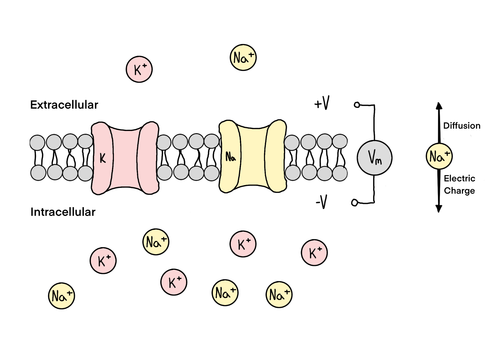{#fig:membrane_diagram fig-align=center}

The cell membrane acts as a dielectric separating two charged mediums, in other words it acts as a capacitor. According to the capacitor current-voltage equation, we know that $C \frac{dV}{dt} = I$. Applying this to the context of the neuron membrane, we get equation (\ref{eqn:lif3}). Where $V_m$ is the potential difference across the cell membrane, $C_m$ is a constant representing the characteristic capacitance of the cell membrane, $I_{Na}$ and $I_K$ are the net charge flows of sodium and potassium ions respectively, $I_L$ is the leakage current caused by the movement of other ions, and $I_{ext}$ is the external current applied to the neuron. So we see that the sum of currents causes the voltage to change. 

\begin{equation}
C_{m}\frac{dV_{m}}{dt} = -(I_{Na} + I_{K} + I_{L} - I_{ext})
\label{eqn:hh1}
\end{equation}

The currents - $I_{Na}$, $I_K$, and $I_{L}$ - are determined by equations (\ref{eqn:hh2}), (\ref{eqn:hh3}) and (\ref{eqn:hh4}). They can be examined like the classic $I =V/R=Vg$ equation ($g$ being conductance). Where the left hand side is the current, the part in the brackets is the voltage, and the part outside the brackets is the conductance of the gates which the ions flow through.  

\begin{equation}
I_{Na} = \bar{g}_{Na} m^{3}h(V_m-E_{Na})
\label{eqn:hh2}
\end{equation}

\begin{equation}
I_{K} = \bar{g}_{K} n^{4} (V_m - E_{K})
\label{eqn:hh3}
\end{equation}

\begin{equation}
I_{L} = \bar{g}_{L}(V_m - E_{L})
\label{eqn:hh4}
\end{equation}

When there is an imbalance in the force of *electric attraction* and *diffusion*, there is a *net flow of ions*, i.e. a current. This represented in equation (\ref{eqn:hh2}) by the term $(Vm-E_{Na})$. Where $E_{Na}$ is the equilibrium potential due to diffusion forces. When the two variables are in balance their difference is $0$, thus the current is also zero. The same also applies for equations (\ref{eqn:hh3}) and (\ref{eqn:hh4}). 

As per equation (\ref{eqn:hh2}) the current also depends on the *conductance* of the channels which the ions move through. There are specialised channels for Na+ ions and for K+ ions, which have different conductances. The conductance of sodium channels is given by $\bar{g}_{Na} m^{3}h$. The $\bar{g}_{Na}$ term is the conductance of the channel when it is fully open, i.e. the channels maximum conductance. The $m^3h$ term is the probability - 0 to 1 - that a sodium channel is open. This probability comes from the fact that each channel has 3 "m" gates and 1 "h" gate, ions can only flow through the channel when all gates are open. Due to the large number of channels in a neuron, the value of the probability will correspond to what proportion of the channels are open. The probabilities of $m,\ h,\ n$ are given by equation (\ref{eqn:hh5}), where $\alpha _x$ and $\beta _x$ are rate constants at which speed the gates open and close respectively, they are voltage dependent.

\begin{equation}
\frac{dx}{dt} = \alpha _{x}(V_{m})(1-x) - \beta _x (V_m)(x), \ where \ x \in \{m,h,n\}
\label{eqn:hh5}
\end{equation}

Simple first order ion flow equations characterise how the neurons in our brain function to a high degree of accuracy. Figures \ref{fig:response_of_hh_1}, \ref{fig:response_of_hh_15}, and \ref{fig:response_of_hh_2} show how a neuron would react to a 5ms, 15ms, and 20ms pulse of current. While the HH neuron model has propelled our understanding of neurons due to it's biophysical precision, it's complexity makes it computationally expensive to simulate. As a result researchers had to look elsewhere to find a neuron model which could be used to efficiently train machines.

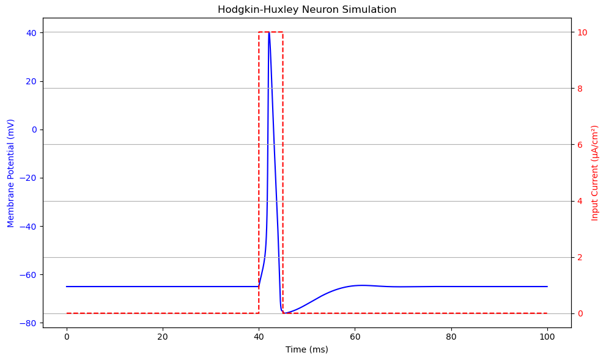{#fig:response_of_hh_1 fig-align=center}

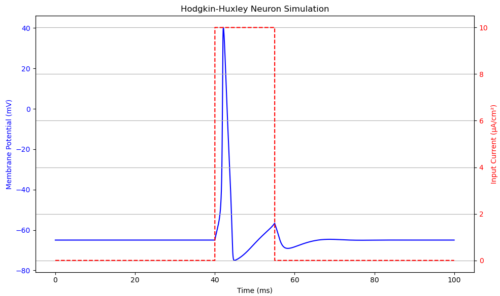{#fig:response_of_hh_15 fig-align=center}

{#fig:response_of_hh_2 fig-align=center}

### Leaky Integrate-and-Fire Neuron

The leaky integrate-and-fire (LIF) neuron model is the most widely used neuronal model in SNNs due to its simplicity and efficiency which helps it scale for large networks. The neuron receives spikes from "pre-synaptic" neurons (see figure \ref{fig:second_vs_third_gen} (b)) - e.g. neurons which feed into the neuron in question. These spikes increase the "membrane potential" of the neuron - e.g. the voltage between the inside and outside of the neuron. When the membrane potential reaches a threshold voltage, the neuron in question fires a spike to the neurons that it is connected to, and it's membrane voltage resets to a baseline value. 

In order to be modelled computationally, this behaviour is expressed in mathematical terms. Spikes received by a neuron at time $t$ induce a current $X[t]$. This input current increases the voltage between the inside and outside of the neuron, H[t] is the intermediate value for the voltage. The voltage decays over time, the speed of the decay depends on the membrane time constant, $\tau$. This is what equation (\ref{eqn:lif1}) describes. This spiking logic is defined in equation (\ref{eqn:lif2}), where $\Theta(x)$ is a function that is $0$ unless $x\geq0$. Equation (\ref{eqn:lif3}) describes that when the threshold voltage is reached, $V[t]$ is set to $V_{reset}$ and a spike is released; if the threshold voltage is not reached then $V[t] = H[t]$.

\begin{equation}
H[t] = V[t-1] +\frac{1}{\tau}(X[t]-(V[t-1]-V_{reset})),
\label{eqn:lif1}
\end{equation}

\begin{equation}
S[t] = \Theta(H[t]-V_{th}),
\label{eqn:lif2}
\end{equation}

\begin{equation}
V[t]=H[t](1-S[t])+V_{reset}S[t]
\label{eqn:lif3}
\end{equation}

Here is what the spiking and decaying behaviour of a leaky integrate-and-fire neuron looks like. Spikes are released at the output of the neuron at, 

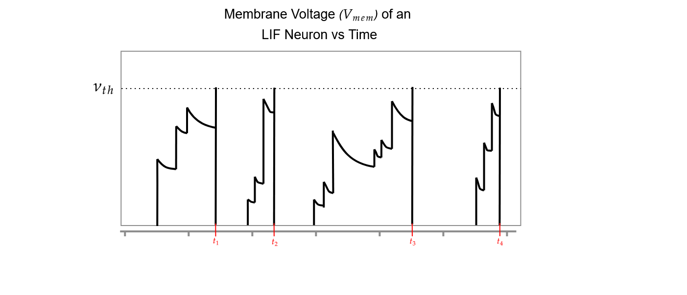{#fig:lif_neuron_dynamics fig-align=center}

### Izhikevich

Building on the simplicity of the leaky integrate-and-fire (LIF) neuron, which uses a single differential equation and a fixed threshold to generate spikes, the Izhikevich model strikes a balance between biological realism and computational efficiency [@izhikevichSimpleModelSpiking2003]. Eugene Izhikevich observed that Hodgkin–Huxley-type models, while highly detailed, require integrating four equations per neuron, which make large-scale simulation infeasible, and that simple integrate-and-fire models cannot reproduce many cortical firing patterns [@izhikevichSimpleModelSpiking2003]. To address this, he derived a minimal two-variable model that can emulate diverse neuron behaviours by tuning just four parameters [@izhikevichWhichModelUse2004].

Mathematically, the model comprises these coupled ordinary differential equations:

\begin{equation}
\frac{dt}{dv}=0.04v^2+5v+140−u+I(t),
\label{eqn:iz1}
\end{equation}

\begin{equation}
\frac{du}{dt}=a(b*v - u),
\label{eqn:iz2}
\end{equation}

Where $v$ is the membrane potential (in mV), $u$ is a membrane recovery variable accounting for K+ activation and Na+ inactivation, and $I(t)$ is an external input current [@izhikevichSimpleModelSpiking2003]. When $v$ reaches the peak (typically 30 mV), it is reset alongside $u$ :

\begin{equation}
\text{if } v \geq 30\,\text{mV}, \quad
\begin{cases}
v \leftarrow c \\
u \leftarrow u + d
\end{cases}
\label{eqn:iz3}
\end{equation}

with $(a,b,c,d)$ chosen to match specific neuron types. Despite its simplicity, this formulation reproduces over twenty cortical firing patterns by varying these four parameters, far surpassing the expressive capacity of the LIF model [@izhikevichWhichModelUse2004]. Moreover, Izhikevich demonstrated that this model runs in real time for tens of thousands of neurons on a single CPU core - comparable to LIF performance.

### Neural Networks

However, alone, a neuron does not do anything very impressive; in a network, intelligent behaviour can emerge. When many neurons are connected together, forming a neural network, they can collectively process information, detect patterns, and make decisions. Each neuron receives inputs from other neurons through connections called synapses (figure \ref{fig:simple_neural_network}). These connections have strengths, or "weights", which determine how much influence one neuron has on another; these strengths are visualised by the darkness of the connections in figure \ref{fig:simple_neural_network}. By carefully adjusting these weights, the network can learn to perform complex tasks such as image recognition, speech processing, or decision-making. This idea underpins both biological neural circuits and artificial neural networks used in machine learning.

Recurrent Neural Networks (RNNs) are a class of neural networks which incorporate feedback connections. Unlike typical feedforward networks, where information moves in one direction from input to output, RNNs allow connections that loop back to previous layers or neurons. This architecture enables the network to retain a memory of past inputs. In spiking neural networks this allows the network to encode temporal patterns and maintain memory. 

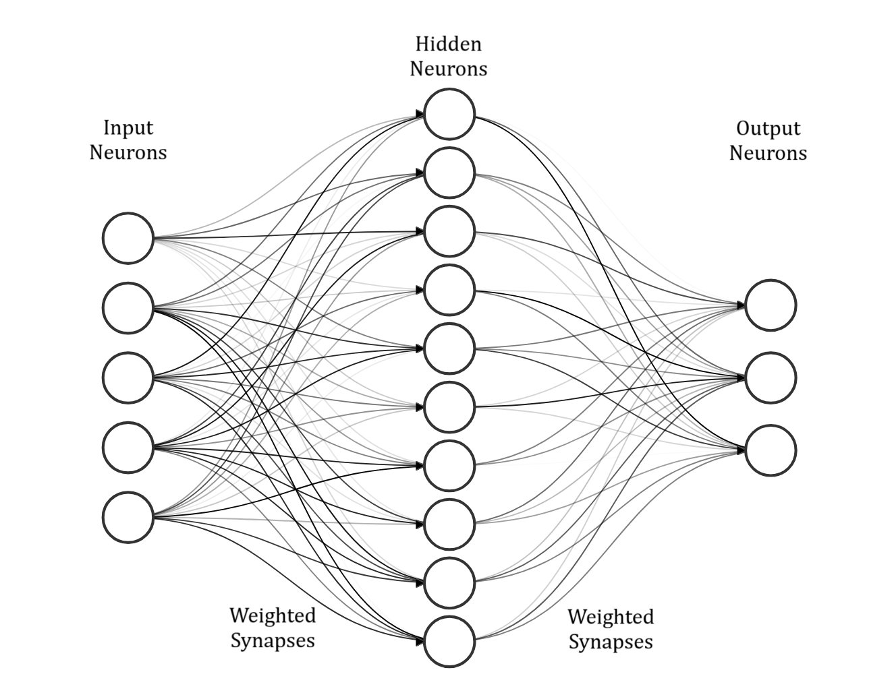{#fig:simple_neural_network fig-align=center width="300px"}

## Training Neural Networks

The objective of training a neural network for spoken word recognition is to construct a model that accurately maps audio input to the correct lexical output. Supervised learning remains the dominant training paradigm in this domain, consistently achieving state-of-the-art results in speech recognition tasks [@dengMachineLearningParadigms2013; @hintonDeepNeuralNetworks2012]. Supervised learning relies on labelled datasets—typically composed of audio clips annotated with their corresponding transcriptions—providing explicit guidance for the model to learn the mapping between acoustic features and linguistic units. In contrast, unsupervised learning operates on unlabelled data, requiring the model to uncover inherent structure or patterns within the input without external annotation. In this section I will introduce backpropagation and explore different ways that spiking neural networks can be trained. 

### Backpropagation

Backpropagation - an efficient implementation of gradient descent - is the most effective and widely used method for training second generation artificial neural networks. It provides a systematic way to adjust the internal parameters - or weights - of a network to minimize the discrepancy between the network’s predictions and the desired outputs. An overview of the backpropagation process is as follows:

1. Forward Pass: The model receives an input and processes it through its layers, generating an output.
2. Error Calculation: The output is compared to the desired target, and a loss function quantifies the error.
3. Gradient Computation: The derivative of the loss function is computed with respect to each weight in the network using the chain rule of calculus.
4. Weight Update: The weights are adjusted by subtracting a fraction of the corresponding gradient, typically scaled by a learning rate. This step moves the model toward a configuration that reduces error.

In supervised learning, the desired output is the label of the data. When a model predicts an output, the "loss" is calculated to quantify the error between the actual output and the desired output. For instance, a common way to calculate the loss is by calculating the mean squared error (MSE), where you find the sum of the squared differences between the actual output neuron values and the desired output neuron values (Equation (\ref{eqn:loss_mse}).

\begin{equation}
L= \frac{1}{n} \sum^{n}_{i=1}(\mathbf{y}_{i}- \hat{\mathbf{y}}_i)^2
\label{eqn:loss_mse}
\end{equation}

To visualise how the loss of a network is minimised, let us assume that a network has 2 weights, $\theta_1$ and $\theta_2$. Figure \ref{fig:gradient_descent_3d_axis} shows the loss plotted against the weights $\theta_1$ and $\theta_2$. The optimal weight configuration occurs at the lowest point on the surface. If the weights of the neural network get initialised to the point $P$, finding the gradient of the surface at that point which will indicate the direction of the steepest ascent. Therefore, going along the surface in the opposite direction of the gradient will follow the fastest path down the surface, minimising the loss function until the local minimum is reached where the gradient becomes 0. This process is known as *gradient descent*, backpropagation is an efficient implementation of gradient descent where the gradient of the network is calculated backwards layer by layer. 

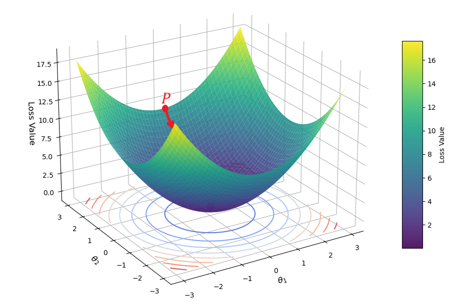{#fig:gradient_descent_3d_axis fig-align=center width="300px"}

To demonstrate how backpropagation works, let's consider a simplified, fully-connected network consisting of a layer of input neurons, hidden neurons, and output neurons (Figure \ref{fig:mlp_3_layer}). Fully-connected means each neuron in a layer is connected to all neurons in the following layer. 

{#fig:mlp_3_layer fig-align=center width="300px"}

The highlighted neuron, $\mathbf{h}_{1}$, is connected to all input neurons, $\mathbf{x}_{1}$, $\mathbf{x}_{2}$, and $\mathbf{x}_{3}$.  Therefore $\mathbf{h}_{1}$ is a weighted sum of all the input neurons (Equation \ref{eqn:weightedsum2}).  

\begin{equation}
\mathbf{h}_{1} = \sum_{i=1}^{3} \mathbf{x}_{i}\times \mathbf{W}_{i}^{xh}
\label{eqn:weightedsum2}
\end{equation}

An efficient way to write these weighted summations for all of the neurons in a layer is by using matrix algebra.

\begin{equation}
\mathbf{h} = \mathbf{x}\times \mathbf{W}^{xh}
\end{equation}

\begin{equation}
\mathbf{y} = \mathbf{h}\times \mathbf{W}^{hy}
\end{equation}

These two equations encompass all of the weighted summations that define the network. The relationship between the weighted summation equation (equation \ref{eqn:weightedsum2}) and the matrix multiplication representation of the network is highlighted in figure \ref{fig:matrix_of_network}. You can see that each input neuron $x_i$ is multiplied by the corresponding weight $w_{i,1}$ and summed to give $h_1$. 

{#fig:matrix_of_network fig-align=center}

Matrix multiplications perform the *forward pass* of the network - i.e. the inference. This inferred output value, $y$, is compared with the true "label" value, $\mathbf{y}_{label}$. The comparison between the actual output and the desired output is dome by a loss function, $l()$. There are many ways of implementing the loss function, one way by finding the mean squared error (MSE):

\begin{equation}
L = l(\mathbf{y}, \mathbf{y}_{label})
\end{equation}

The goal is to minimize this loss by updating the network's weights in the direction of the negative gradient. This requires computing the gradient of the loss with respect to each weight $w_i$:

\begin{equation}
\frac{\partial L}{\partial \mathbf{W}_{ij}}
\end{equation}

We first calculate the gradient of the layer closest to the output, $W^{hy}$.

\begin{equation}
\frac{\partial L}{\partial \mathbf{W}^{hy}} = \frac{\partial L}{\partial \mathbf{y}} \cdot \frac{\partial \mathbf{y}}{\partial \mathbf{W}^{hy}} = \frac{\partial L}{\partial \mathbf{y}} \cdot \mathbf{h}
\end{equation}

We then use the chain rule again to calculate the gradient of $L$ with respect to $W^{xh}$.

\begin{equation}
\frac{\partial L}{\partial \mathbf{W}^{xh}} = \frac{\partial L}{\partial \mathbf{y}} \cdot \frac{\partial \mathbf{y}}{\partial \mathbf{h}} \cdot \frac{\partial \mathbf{h}}{\partial \mathbf{W}^{xh}} = \frac{\partial L}{\partial \mathbf{y}} \cdot \mathbf{W}^{hy} \cdot \mathbf{x}
\end{equation}

This step-by-step application of the chain rule allows the error to be propagated backward through the network, enabling efficient computation of gradients at each layer - this is the essence of backpropagation.

Once the gradients are known, the weights are updated using the gradient descent rule:

\begin{equation}
\mathbf{w}_{ij} \leftarrow \mathbf{w}_{ij} - \eta \frac{\partial L}{\partial \mathbf{w}_{ij}}
\end{equation}

where $\eta$ is the learning rate. A higher $\eta$ would mean faster learning but risks instability. A lower $\eta$ would ensure stable convergence to the minima, but may make the training very slow. 

Repeating this backpropagation process across many training examples allows the network to gradually learn the desired input-output mapping by descending the loss function surface. A problem with this approach to be aware of is that the gradient descent algorithm may find a local minimum of the loss function instead of the global minimum. As a result the performance of the model may be significantly lower than it potentially could be. A popular way of dealing with this problem is by training the network several times with different random weight initialisations; if one network initialisation gets stuck in a local minima, others may not. If there are too many local minima, this approach may not be enough.

While backpropagation has proven to be a powerful algorithm for training artificial neural networks, there have been doubt about weather it can be applied to spiking neural networks (SNNs), due to the non-differentiable nature of spike events, which prevents the straightforward calculation of gradients required for weight updates. In the following section, we introduce several methods for training spiking neural networks, highlighting how they address the challenges of spike-based computation and enable effective learning in spiking systems.

### ANN-to-SNN Conversion

Due to the popularity of ANNs, literature and methods for training them is advanced. This has lead people to train ANNs using state-of-the-art methods, and converting the ANNs to SNNs. Usually a trained artificial neural network is transformed into a spiking neural network by substituting activation functions between neurons with spiking neuron models. This process often involves additional adjustments such as weight normalization and threshold balancing to maintain performance and stability. These ways of training have had good results for some tests [@wuDeepSpikingNeural2020; @bittarSurrogateGradientSpiking2022]. However, such a method incurs large computational costs during conversion and is limited by the architecture of ANNs which are less adaptable to dynamic data like audio [@bellecBiologicallyInspiredAlternatives2019]. Thus, to fully harness the benefits of SNNs — from energy efficiency to novel architectures — effective direct training methods are essential.

### Backpropagation-Through-Time

Similar to the ANN-to-SNN method, Backpropagation-Through-Time (BPTT) attempts to carry over the effectiveness of the backpropagation algorithm to SNNs. However, this time the SNNs get trained directly which allows them to learn dynamic patterns from temporal data. Familiar gradient-based methods are applied in tandem with "surrogate gradients" (SG) which are spike gradient approximations used to overcome the fact that spikes are non-differentiable. Thinking of the network’s activity over time as a very deep chain of simple processing steps; BPTT “unrolls” this chain so that the error at the end can be traced back step by step to adjust every connection [@neftciSurrogateGradientLearning2019]. Because a spike is a discontinuous event (it either happens or it doesn’t), we replace its true derivative - which is zero almost everywhere and jumps to infinity at spike times - with a smooth “surrogate” function during training. This surrogate lets us compute approximate gradients so that standard optimisers like gradient descent can still work [@bellecBiologicallyInspiredAlternatives2019].

When applied to speech‑recognition benchmarks - such as the Spiking Speech Commands (SSC) and Spiking Heidelberg Digits (SHD) datasets - this method achieves accuracy on par with conventional neural networks while operating in a sparse, event‑driven fashion that can be more energy‑efficient at inference time [@bittarSurrogateGradientSpiking2022; @zhouDirectTrainingHighperformance2024]. Researchers have swapped out recurrent layers in end‑to‑end speech models for surrogate gradient trained spiking modules, showing only small drops in word‑error rate and offering a path toward low‑power, real‑time processing [@bittarSurrogateGradientSpiking2022].

However, BPTT comes with two major downsides. First, it requires storing every intermediate state over the entire duration of an input—meaning memory usage grows with the length of the audio clip, which can quickly exceed hardware limits for long recordings [@zhouDirectTrainingHighperformance2024]. Second, because the learning rule relies on a global error signal propagated across many time steps and layers, it differs starkly from the local, synapse‑by‑synapse learning observed in biological brains, this means training would not be feasible directly on neuromorphic platforms. 

#### Parallelisable LIF

A major bottleneck in training spiking neural networks (SNNs) using BPTT is the strictly sequential nature of classic Leaky Integrate‑and‑Fire (LIF) neurons, which update their membrane potential step by step in time. The Parallelizable LIF (ParaLIF) model overcomes this by decoupling the linear integration of inputs from the spiking (thresholding) operation and executing both across all time steps in parallel. This reorganization leverages highly optimized matrix operations on modern accelerators to deliver orders of magnitudes of speed‑ups in training [@arnaudyargaAcceleratingSpikingNeural2025; @yargaAcceleratingSNNTraining2023].

In a standard LIF neuron, the membrane potential $V(t)$ at time $t$ depends on its previous value $V(t−1)$ plus any new inputs, and a spike is emitted once $V$ crosses a threshold. ParaLIF rewrites this process as two separate GPU kernels. The first kernel computes, for every neuron, the entire sequence of membrane‑potential updates in one batched matrix multiplication; the second applies the threshold‐and‐reset rule simultaneously at all time points. By removing the need for “time‑step loops,” ParaLIF converts a fundamentally serial simulation into a fully vectorized parallel computation [@arnaudyargaAcceleratingSpikingNeural2025].

When benchmarked on neuromorphic speech (Spiking Heidelberg Digits), image and gesture datasets, ParaLIF achieves up to 200× faster training than conventional LIF models, while matching or exceeding their accuracy with comparable levels of sparsity [@arnaudyargaAcceleratingSpikingNeural2025; @yargaAcceleratingSNNTraining2023]. Compared to other parallel schemes ParaLIF maintains similar speed‑ups on short sequences and far greater scalability on very long inputs [@yargaAcceleratingSNNTraining2023].

However, this method comes with notable disadvantages. By reorganizing the time dimension, ParaLIF departs from the continuous, step‑by‑step integration that real neurons exhibit, reducing its biological plausibility. This parallel update can also undermine the network’s ability to capture fine temporal dependencies, since precise spike timing and sequential context are approximated rather than explicitly modelled [@koopmanOvercomingLimitationsLayer2024; @zhongSPikESSMSparsePrecise2024]. Moreover, the specialized GPU kernels and data‑layout transformations needed for ParaLIF introduce implementation complexity and may not map efficiently to more constrained neuromorphic hardware, limiting its applicability in low‑power edge scenarios, a key potential application of SNNs.

### Eligibility Propagation

In contrast, eligibility propagation, or e‑prop, is a method for training spiking neural networks (SNNs) that aligns more closely with how learning is believed to occur in the brain while still taking inspiration from the clearly effective backpropagation algorithm. Unlike traditional training methods like backpropagation‑through‑time (BPTT), which require storing the entire history of neuron activities and propagating errors backward through time, e‑prop simplifies this process by using eligibility traces and a learning signal. Eligibility traces act like short‑term memories at each synapse, recording recent activity patterns. They capture how the timing of spikes affects the potential for learning. The learning signal is a global factor that represents the overall error or feedback from the network's output. Instead of sending detailed error information back through every layer and time step, as in BPTT, e‑prop uses this single signal to modulate the eligibility traces. When the network makes a mistake, the learning signal adjusts the synapses with high eligibility traces, effectively correcting the connections that contributed most to the error.

By updating synaptic weights immediately based on recent pre‑ and post‑synaptic activity, e‑prop reduces memory requirements compared to BPTT [@bellecEligibilityTracesProvide2019] and can dramatically lower energy consumption on event‑driven hardware [@bellecEligibilityTracesProvide2019a; @rostamiEpropSpiNNaker22022]. For instance, spiking recurrent networks were trained on the neuromorphic SpiNNaker 2 system for the Google Speech Commands dataset, achieving over 91% accuracy with only 680KB of training memory over 12× lower energy consumption than GPU‑based BPTT solutions [@rostamiEpropSpiNNaker22022a].

Though it can be argued that the potential of e-prop is limited due to it not scaling well. It requires maintaining multiple eligibility traces per synapse (e.g., for membrane potential and adaptive threshold), as well as optimizer state such as moment vectors, resulting in significant memory overhead for large networks [@rostamiEpropSpiNNaker22022]. Moreover, because it employs approximate surrogate gradients rather than true backpropagation, e‑prop–trained models typically achieve lower accuracy than their BPTT‑trained counterparts [@bellecEligibilityTracesProvide2019]. Third, although e‑prop avoids backward error propagation through time, it still depends on a global learning signal to modulate local eligibility traces, introducing communication overhead and deviating from strictly local synaptic updates—factors that can limit its energy efficiency on distributed neuromorphic hardware [@bellecEligibilityTracesProvide2019a]. 

### Spike-Time-Dependent-Plasticity

Spike-timing-dependent plasticity (STDP) represents a training approach for SNNs that draws even greater inspiration from the learning rules observed in biological neurons. STDP is a biological learning rule that adjusts the strength of synaptic connections based on the precise timing of pre-synaptic and post-synaptic spikes. If a pre-synaptic neuron fires just before a post-synaptic neuron, the connection between them is strengthened. Conversely, if the order is reversed, the connection is weakened. This temporally sensitive form of Hebbian learning, often summarized by the maxim "cells that fire together, wire together," operates locally at each synapse and does not require global error signals. This makes it inherently biologically plausible, asynchronous, and capable of unsupervised learning.

{#fig:stdp_ltp_ltd fig-align=center width="300px"}

Reward-modulated STDP (R-STDP) extends the basic STDP rule by incorporating a global reward or punishment signal that modulates the synaptic weight changes. This allows the network to learn task-specific features by reinforcing connections that contribute to correct outputs and weakening those associated with errors. R-STDP bridges the gap between unsupervised STDP and supervised learning, enabling SNNs to tackle more complex, goal-oriented tasks like speech recognition. The reward signal in R-STDP can potentially be implemented using neuromodulators, further enhancing the biological plausibility of SNN training.

STDP has been employed to train SNNs for speech recognition, often in conjunction with temporal coding schemes such as time-to-first-spike for efficient processing. It has been used for unsupervised feature extraction from speech signals, with subsequent classification using methods like Hidden Markov Models (HMMs) or tempotrons. STDP-based convolutional SNNs have shown promise in achieving accurate and efficient speech recognition, with performance levels approaching those of traditional ANNs in certain scenarios.

Memristors are two‑terminal devices whose conductance changes based on the history of voltage or current, closely mimicking how biological synapses adjust their efficacy [@chenEssentialCharacteristicsMemristors2023]. In memristor‑based STDP, each memristor stores a synaptic weight in its conductance, and weight updates occur directly on‑chip whenever spikes arrive, following the device’s own switching dynamics [@liResearchProgressNeural2023]. By collocating memory and computation, this approach avoids the von Neumann bottleneck and enables energy‑efficient, on‑device learning in neuromorphic hardware [@weilenmannSingleNeuromorphicMemristor2024].

Vlasov et al. (2022) demonstrated this concept on a spoken‑digit recognition task by training spiking neural networks with memristor‑based STDP using two memristor types - poly‑p‑xylylene (PPX) and CoFeB–LiNbO₃ nanocomposite [@vlasovSpokenDigitsClassification2022]. Their networks, deployed entirely on neuromorphic hardware, achieved classification accuracies between 80 % and 94 % depending on network topology and decoding strategy, rivalling more complex off‑chip learning algorithms while consuming minimal power and memory [@sboevSpokenDigitsClassification2024].

While promising, training deep spiking neural networks to achieve state-of-the-art accuracy on complex tasks using STDP-based approaches presents significant challenges compared to conventional backpropagation methods [@guoDirectLearningbasedDeep2023]. Specifically, STDP itself can be sensitive to hyperparameter choices and network architecture [@leeTrainingDeepSpiking2018]. Moreover, it may prioritize frequently occurring features over those most discriminative for a given task [@bittarSurrogateGradientSpiking2022a].

### Eventprop

A novel, accurate, and efficient training algorithm. Eventprop uses the adjoint method from optimisation theory to implement backpropagation in an efficient manner for spiking neural networks. Unlike other implementations of backpropagation for SNNs, Eventporp computes *exact* gradients to train the network, as opposed to approximate surrogate gradients typically used in BPTT. Moreover, it does so while using less compute and memory resources, reaching state-of-the-art (SOTA) performance for the SHD dataset while using 4x less memory and running 3x faster [@nowotnyLossShapingEnhances2025].  

What allows Eventprop to be so efficient is its event-driven nature. Similar to the forward propagation of information in an SNN, the backward propagation of error signals in Eventprop occurs only at the precise times of recorded spikes [@wunderlichEventbasedBackpropagationCan2021], see how in figure \ref{fig:eventprop_backpropagation} the backpropagated error signals occur at the same time in the backward propagation as the spike signals do in the forward propagation. This results in significant temporal and spatial sparsity in the computation, leading to reduced computational cost and improved efficiency, especially for parallel computing architectures such as the ones in GPUs. Furthermore, Eventprop offers favourable memory requirements compared to methods like BPTT. It only necessitates the storage of neuron states at the times of spike events, rather than at every time step, which can drastically reduce memory usage, particularly for long input sequences common in speech recognition tasks. This memory efficiency makes Eventprop well-suited for implementation on resource-constrained neuromorphic hardware, this was recently explored, with successful deployments on platforms like Intel's Loihi 2, showcasing its potential for low-power, event-based machine learning on specialized hardware [@shoesmithEventpropTrainingEfficient2025]. 

![Spikes propagated forward according to LIF neuron dynamics. Error signals propagated backward via computing adjoint variables backwards in time. [@nowotnyLossShapingEnhances2025]](images/eventprop_backpropagation.png){#fig:eventprop_backpropagation fig-align=center}

Eventprop has demonstrated its effectiveness on challenging speech recognition benchmarks. It has achieved state-of-the-art performance on the Spiking Heidelberg Digits (SHD) dataset and shown good accuracy on the Spiking Speech Commands (SSC) dataset when training recurrent spiking neural networks. Notably, when compared to leading surrogate gradient-based SNN training methods, implementations of Eventprop have been shown to be significantly faster (up to 3x) and require considerably less memory (up to 4x) [@nowotnyLossShapingEnhances2025]. This efficiency allows for scaling SNN training to more complex tasks and larger models, which have yet to be explored and could potentially increase the accuracy of models further. 

Eventprop's flexibility extends to its compatibility with a wider class of loss functions [@nowotnyLossShapingEnhances2025], including those commonly used with BPTT, allowing researchers to tailor the training process to specific task requirements. Furthermore, the Eventprop formalism can be extended to incorporate learnable delays within SNNs, which can be crucial for capturing temporal dependencies in sequential data like speech. It has been shown that training neuron model parameters like the membrane time constant or the synapse time constants - which control how fast the neuron voltage and current decay - can achieve good results.

In summary, Eventprop is a direct training method - unlike ANN-to-SNN conversion - which enables it to train networks of architectures more suited to SNNs without requiring the costly conversion step. Eventprop performs more efficiently - both computationally and memory wise - than BPTT implementations, scaling better for longer sample durations. In addition, unlike the Parallelisable-LIF implementation of BPTT - which does come with performance increases - Eventprop doesn't increase the complexity of neuronal model implementations which allows it do be implemented in neuromorphic hardware, unlocking the great potential of efficiency for SNNs. Not only does Eventprop scale better than eligibility propagation (e-prop) in terms of compute resources, it also doesn't use approximate gradients and thus achieves better performance. And finally, Eventprop is easier to train for complex tasks than spike-timing-dependent-plasticity (STDP) based approaches, requiring less computational resources and achieving better performance. For these reasons I have chosen to train spiking neural networks using Eventprop for speech recognition; it shows great potential for efficiently and accurately training larger models which can be used for efficient edge processing.

#### Mathematics of Eventprop

At the core of Eventprop is the "adjoint method" from optimisation theory. The adjoint method is a highly efficient mathematical technique for calculating the sensitivity of a function's output to the functions parameters. In the case of optimising neural networks, the adjoint method would calculate the sensitivity of the network's loss function to changes in the synaptic weights of the network; this sensitivity information is used to optimise the algorithm. The adjoint method is very computationally efficient, the cost of computing the gradient is nearly independent of the number of parameters; unlike in methods such as finite differences, where the computational cost scales linearly  with the number of parameters. This linear scaling would become prohibitive in large networks. 

An adjoint system to the leaky integrate-and-fire (LIF) network has been derived by [@wunderlichEventbasedBackpropagationCan2021] and is shown in figure \ref{fig:eventprop_free_dynamics}. The adjoint variables for the input current and membrane voltage are $\lambda_I$ and $\lambda_V$ respectively. They represent how sensitive the loss function is to changes to the input current or membrane voltage for a given neuron at a given time. By solving the adjoint equations backwards in time, going from $t=T$ to $t=0$, you are left with all the values of $\lambda_I$. Summing the values of $\lambda_I$ at spike events - received by neuron $j$ and transmitted by neuron $i$ - and multiplying this sum by $-\tau_{syn}$ you get the gradient of the loss function with respect to weight $w_{ji}$. This is described in equation (\ref{eqn:loss_grad_weight}).

\begin{equation}
\frac{d\mathcal{L}}{dw_{ji}}  = -\tau_{syn} \sum_{spikes\ from\ i} (\lambda_I)_j
\label{eqn:loss_grad_weight}
\end{equation}

![Spikes propagated forward according to LIF neuron dynamics. Error signals are propagated backword according to the adjoint system. [@nowotnyLossShapingEnhances2025]](images/forward_backward_dynamics_evp.png){#fig:eventprop_free_dynamics fig-align=center}

Figure \ref{fig:eventprop_free_dynamics} shows the maths for general loss functions; the spike time dependent loss, $l_p$, and the output neuron voltage dependent loss, $l_V$. This allows flexibility in how loss functions are defined, enabling the shaping of loss functions to suit the task. On the SHD dataset, Eventprop has achieved state-of-the-art accuracy by using a loss function based on the membrane voltage of the output neurons [@nowotnyLossShapingEnhances2025]. 

Initially, researchers tried using a simple loss function that integrated the voltage at an output neuron over the whole recording, $\int^{T}_{0} V(t) dt$. Each of the 20 output neurons correspond to a spoken digit, 0 - 9 in English and German. The output neuron with the highest integral is what the network infers was said in the recording. The loss function took this integral for each output neuron, and calculated the loss using log-softmax function, as in equation (\ref{eqn:lsum}). 

\begin{equation}
\mathcal{L}_{sum} = -\frac{1}{N_{batch}} \sum^{N_{batch}}_{m=1}log(\frac{exp(\int^{T}_{0} V^{m}_{l(m)}(t) dt )}{\sum^{N_{out}}_{k=1}exp(\int^{T}_{0} V^{m}_{k}(t) dt)})
\label{eqn:lsum}
\end{equation}

Where $V_{k}$ is the voltage at neuron k, and $V_{l(m)}$ is the voltage at the correct neuron (the one the corresponds with the recording label). This loss function has shown better accuracy than alternatives. One alternative is based on the timing of the first spike - the first spike to arrive at an output neuron determines how the recording is classified. Another alternative classifies the recording based on the max membrane voltage reached in the output neurons. 

While it had the best accuracy, it was found that the learning rate of this sum based loss function, $\mathcal{L}_{sum}$, was very slow. When spikes reach the output neurons, the membrane voltage of the output neuron increases, and then decays based on the membrane time constant, $\tau_{mem}$. However, if spikes reach the output neurons near the end of the trial, the tail-end of the decaying voltage will be cut off, see figure \ref{fig:voltage_cutoff}. Changing the weights between neurons affects the timing of the spikes they generate; a stronger synaptic connection will increase the voltage in the post-synaptic neuron faster, and thus it will reach the threshold voltage quicker. Changing the timing of the spikes occurring near the end of the recording will cause more or less of their area to be cut-off. Therefore, their timing will affect the loss - which is the result of the output neuron membrane voltage integrated over the duration of the trial - far more than earlier spikes. This disproportionate effect that later spikes have on the loss is an arbitrary artifact of the trial duration end, and causes learning to be slower and less efficient.

{#fig:voltage_cutoff fig-align=center}

To improve gradient flow, a weighted sum based loss was proposed and tested, $\mathcal{L}_{sum\_exp}$ in equation (\ref{eqn:lsumexp}). This weights earlier spikes exponentially more than the later spikes according to the $e^{-t/T}$ term. This loss function ended up achieving state-of-the-art accuracy.  

\begin{equation}
\mathcal{L}_{sum\_exp} = -\frac{1}{N_{batch}} \sum^{N_{batch}}_{m=1}log\frac{exp(\int^{T}_{0} e^{-t/T}V^{m}_{l(m)}(t) dt )}{\sum^{N_{out}}_{k=1}exp(\int^{T}_{0}e^{-t/T}V^{m}_{k}(t) dt)}
\label{eqn:lsumexp}
\end{equation}

However, I hypothesise that this loss function is still sub-optimal. While it deals with the edge case of the final spikes, it now over-emphasises early spikes. In particular, I am referring the spikes that happen instantaneously to the recording beginning, since at that time there is still no way to know what the word is, therefore they are just a result of noise. Moreover, they occur before the recurrent network's rich temporal dynamics have had a chance to play-out. I predict that this causes the rate of learning of the network to be slowed because random noise is emphasised and the actual signal is attenuated. It can be seen in figure \ref{fig:spikes_hidden_to_output} that there are spikes which reach the output neurons almost instantly. 

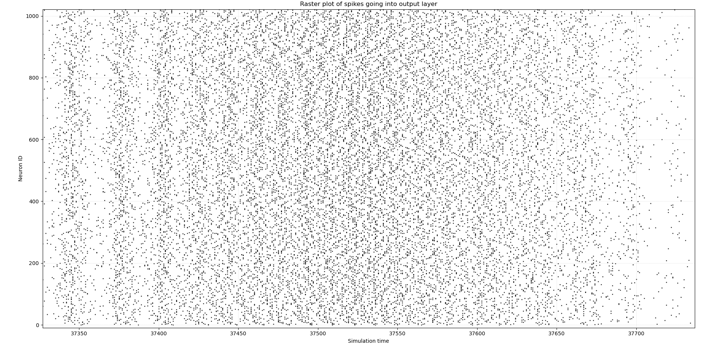{#fig:spikes_hidden_to_output fig-align=center}

This is why I will explore deriving and implementing a novel loss function and Eventprop scheme. More on this in the methods section. 

# Methods

## Dataset used 

The Spiking Heidelberg digits dataset [@SpikingHeidelbergDigits] is derived from the Heidelberg Digits dataset, comprising approximately 10,000 high-quality recordings of spoken digits (0 to 9) in English and German. These recordings feature a balanced group of 12 speakers (6 males and 6 females) aged between 21 and 56 years, with a mean age of 29. The audio data is converted into spike trains using the Lauscher artificial cochlea model, resulting in 700 input channels that represent different frequency bands detected by the human ear. This transformation captures the temporal dynamics of speech, making the dataset suitable for training and evaluating SNNs that process time-dependent information. The data is split between roughly 8,000 recording for the training (and validation) and 2,000 test recordings which the model will not have seen before.  

The SSC dataset is a spiking version of the Google Speech Commands dataset, containing a large number of utterances across 35 word categories. These recordings are processed using the same Lauscher artificial cochlea model as in SHD, producing spike trains over 700 input channels [@PapersCodeSSC]. The SSC dataset encompasses a broader vocabulary and a larger speaker base, providing a more extensive benchmark for SNNs in speech recognition tasks.​ 

The TIMIT Acoustic-Phonetic Continuous Speech Corpus is a dataset containing a diverse group of English speakers reading phonetically-rich sentences with detailed transcription [@garofoloTIMITAcousticPhoneticContinuous1993]. A downside of TIMIT is that it is not free, needing a license to be used. LibriSpeech ASR Corpus is a very large-scale dataset containing 1,000 hours of speech derived from audio books [@panayotovLibrispeechASRCorpus2015]. While it is free, the fact that it is read out loud means it may not generalise well to spontaneous conversational speech, such as might be used when engaging with a large language model through your smartphone or smart-glasses. Another prevelant speech dataset is the TIDIGITS dataset, containing recordings of digits spoken in sequence [@r.garyleonardTIDIGITS1993], making it more complex than the SHD dataset which contains recordings of single digits being spoken. However, a major issue with all of these alternatives to SHD and SSC is that they aren't inherently spike-based, this would cause less fair comparisons between competing training algorithms as researchers might have differing ways of converting the datasets to spiking datasets. This is why the SHD and SSC datasets are the most prevalent in the research of applying spiking neural networks to speech recognition. I will use the SHD dataset. 

## Software Libraries

There are several libraries which implement core Eventprop functionality. The first library I considered [@savareseLolemacsPytorcheventprop2024] was based on PyTorch, which is a very widely use machine learning framework that I am familiar with, with significant GPU optimisations. However, PyTorch is mainly used for ANNs, therefore it is not as optimised for SNNs; this fact could cause long training times, delaying development. 

Next I evaluated a C++ based library implemented by one of the authors of the paper which first introduced Eventprop [@nowotnyTnowotnyGenn_eventprop2025]. Being implemented in C++ - a low level programming language - means it has very little computational overhead, enabling it to run very fast. However, though the code can run fast on CPUs, it is not optimised to run on GPUs. Since neural networks calculate many things in parallel, using a CPU to run training would be very slow compared to running training on a GPU. To be optimised for GPUs, the C++ code would need to utilise a software extension like CUDA - an industry standard platform for accelerating computation using Nvidia GPUs. 

The library that I chose to use for implementing and training neural networks [@nowotnyTnowotnyGenn_eventprop2025] uses the GeNN - GPU enhanced Neuronal Network - framework to accelerate spiking neural networks using CUDA. The GeNN framework, developed by a professor at University of Surrey, is highly optimised for GPUs, allowing much faster development and testing of models and algorithms. Moreover, it is the library that was used to achieve state-of-the-art accuracy on the SHD dataset, and has functionality to use the previously discussed $\mathcal{L}_{sum\_exp}$ function. 

Having chosen the library I will use to implement Eventprop, I installed a Linux environment in which I will develop and run code. I chose to use Linux due to the availability of software tools, and previous professional experience in developing artificial intelligence software on Linux. Next I read the documentation of the Eventprop library to understand the required packages, such as CUDA, compatible C++ compilers, and more. Having installed the necessary packages, I  set up other environmental setting such as the Linux \$PATH\$. 

## Training the Network

First I implemented the model used in [@nowotnyLossShapingEnhances2025], using optimal hyperparameters. The model uses Leaky Integrate-and-Fire neuron model with exponential synapses. The model has a single hidden layer with 512 neurons. The hidden layer is recurrent, being fully connected into itself. The model is trained for 300 epochs, the best model out of 300 is saved. It is then tested against the completely new test data. I did this for the current state-of-the-art loss, $\mathcal{L}_{exp\_sum}$.

## Deriving an New and Improved Loss Function and Eventprop Scheme 

The current best loss function for Eventprop in the literature has a decreasing exponential weighting for the voltage at the output neurons. The mathematical representation of the exponential weighting can be observed in equation (\ref{eqn:exp_sum_simple}). This kind of weighting reduces the arbitrarily exaggerated impact that the spikes near the end of the recording have on the loss, improving gradient descent. However, a side-effect of this function is that it emphasises the spikes which occur instantaneously. These instantaneous spikes occur while the word in question has barely begun to be said, a judgement on the word at that point would simply be a guess which would not correlate with the ground truth, hence these instantaneous spikes are simply noise. As electronic engineers know from signal processing, *noise is something that should be attenuated not amplified*. 

\begin{equation}
V_{exp\_sum}(t) = e^{-t/T}\ V(t) 
\label{eqn:exp_sum_simple}
\end{equation}

An improved loss function would take what the exponential loss function did well - fixing the issue of spikes near the end being arbitrarily emphasised - while also attenuating spikes occurring instantaneously. It should be a continuous function, so that it can be differentiated for backpropagation. I first considered the Gaussian function, famously known as the "bell curve". It will weight early and late spikes lower, while keeping the spikes in the middle weighted high. 

\begin{equation}
V_{bell}(t) = a \exp{\left( \frac{( -t/T) - b)^2} {2c^2}\right)}\ V(t)
\label{eqn:bell_sum_simple}
\end{equation}

The exponential weighting and bell curve weightings from equations (\ref{eqn:exp_sum_simple}) and (\ref{eqn:bell_sum_simple}) are plotted in figure \ref{fig:exp_vs_bell_plot}. The term $-t/T$ is a ratio of the current simulation time and the total simulation duration, therefore it exists between 0 (the beginning of the simulation) and 1 (the end of the simulation).
 

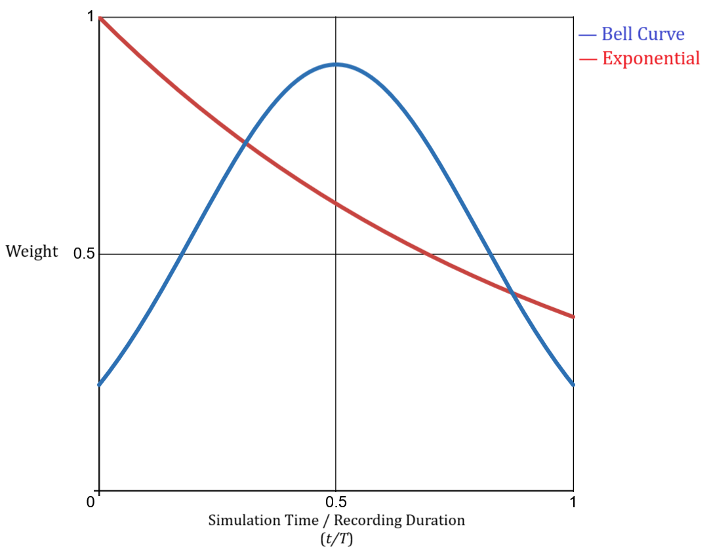{#fig:exp_vs_bell_plot fig-align=center width="300px"}

The inefficiencies of training caused by very early and very late spikes are of a different nature, therefore it would be beneficial to enable the weighting function to be asymmetrical. This would allow scaling early spikes differently to late spikes. To do this I modified the standard Gaussian function, scaling it by $-t/T$, this gave it a distinct shape, rising quickly earlier in the recording, and fading slowly near the end (figure \ref{fig:exp_vs_gaus_plot}). 

\begin{equation}
V_{gausian\_mod}(t) = a - b\frac{t}{T} exp \left( \frac{- (t/T)^2}{2c^2 }  \right)\ V(t)
\label{eqn:gaus_sum_simple}
\end{equation}

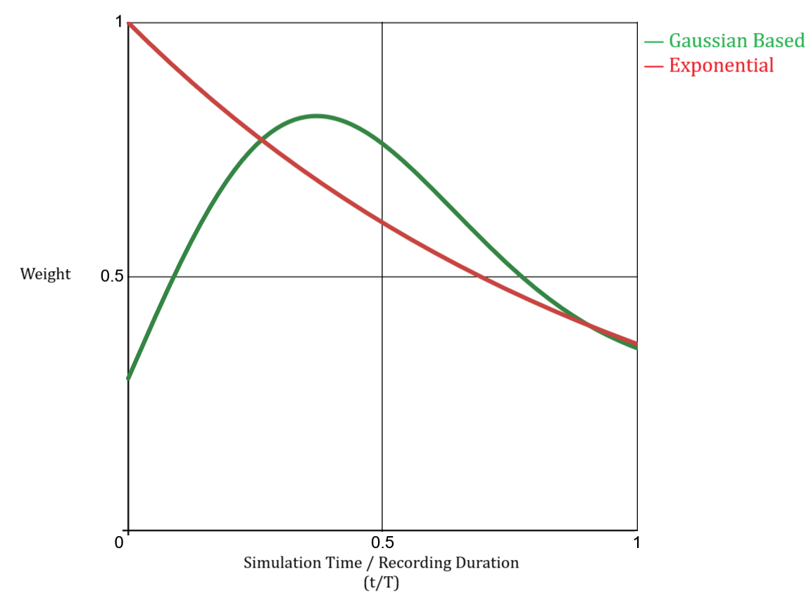{#fig:exp_vs_gaus_plot fig-align=center width="300px"}

	
Implementing this modified Gaussian function in the log-softmax form give the new loss function, $\mathcal{L}_{sum\_gaus}$ in equation (\ref{eqn:lif3}). 

\begin{equation}
\mathcal{L}_{sum\_gaus} = -\frac{1}{N_{batch}} \sum^{N_{batch}}_{m=1}log \frac{exp(\int^{T}_{0} a - b\frac{t}{T} exp \left( \frac{- (t/T)^2}{2c^2 }  \right) V^{m}_{l(m)}(t) dt )}{\sum^{N_{out}}_{k=1}exp(\int^{T}_{0} a - b\frac{t}{T} exp \left( \frac{- (t/T)^2}{2c^2 }  \right) V^{m}_{k}(t) dt)}
\label{eqn:lsumgaus}
\end{equation}

As discussed before, the gradient for each weight is backpropagates by solving for the adjoint variables - $\lambda_V$ and $\lambda_I$ - backwards in time. These adjoint variables represent how sensitive the loss is to changes in the state variables - $V$ and $I$ - at a given neuron at a given time. The dynamic properties of these adjoint variables are given by a system of ordinary differential equations (ODEs) - equations (\ref{eqn:lambda_ode}) and (\ref{eqn:lambda_gradient_ode}). Solving for $\tilde{\lambda}_{I,j}(t)$ - which is the adjoint variable for the current summed over an entire batch (equation (\ref{eqn:lambda_i_tilde}))  - allows for finding the gradient of the loss function with respect to the weight $w_{ji}$ - which connect neurons $j$ and $i$ - as is described in equation (\ref{eqn:derivative_of_loss}). These equations are for a general loss function $\mathcal{L}_F = F\left(\int_0^T l_V dt\right)$, where $l_V$ is a function of output neuron voltages. 

\begin{equation}
\tau_{\text{syn}} \tilde{\lambda}_{I,j}^{\prime} = -\tilde{\lambda}_{I,j} + \tilde{\lambda}_{V,j},
\label{eqn:lambda_ode}
\end{equation}

\begin{equation}
\tau_{\text{mem}} \tilde{\lambda}_{V,j}^{\prime} = -\tilde{\lambda}_{V,j} - \sum_n \frac{\partial F}{\partial \left(\int l_V^n dt\right)} \frac{\partial l_V^n}{\partial V_j}
\label{eqn:lambda_gradient_ode}
\end{equation}

\begin{equation}
\begin{aligned}
\frac{d\mathcal{L}_F}{dw_{ji}} &= -\tau_{\text{syn}} \sum_{t \in t_{\text{spike}}(i)} \tilde{\lambda}_{I,j}(t)
\end{aligned}
\label{eqn:derivative_of_loss}
\end{equation}

Where:

\begin{equation}
\tilde{\lambda}_{I,j} := \sum_n \frac{\partial F}{\partial \left(\int l_V^n dt\right)} \lambda_{I,j}^n(t) 
\label{eqn:lambda_i_tilde}
\end{equation}

and

\begin{equation}
\tilde{\lambda}_{V,j} := \sum_n \frac{\partial F}{\partial \left(\int l_V^n dt\right)} \lambda_{V,j}^n 
\label{eqn:lambda_v_tilde}
\end{equation}

To integrate the new, Gaussian based loss function, $\mathcal{L}_{sum\_gaus}$, into the Eventprop scheme we formulate the gradient of the loss as:

\begin{equation}
\begin{aligned}
\frac{d\mathcal{L}}{dw_{ji}} &= \frac{1}{N_{\text{batch}}} \sum_{m=1}^{N_{\text{batch}}} \frac{d}{dw_{ji}} \left( -\log \frac{\exp\left(\int_0^T   a - b\frac{t}{T} exp \left( \frac{- (t/T)^2}{2c^2 }  \right)   V_{l(m)}^m(t) dt\right)}{\sum_{k=1}^{N_{\text{out}}} \exp\left(\int_0^T a - b\frac{t}{T} exp \left( \frac{- (t/T)^2}{2c^2 }  \right) V_k^m(t) dt\right)} \right) \\
&= \frac{1}{N_{\text{batch}}} \sum_{m=1}^{N_{\text{batch}}} \frac{dF^m}{dw_{ji}},
\end{aligned}
\end{equation}

Where $F^m$ is the loss of a single trial, $m$, within a batch of trials, $N_{batch}$. Written as a function of the integral of the voltage, $F^m$ becomes:

\begin{equation}
F^m \left( \int_0^T a - b\frac{t}{T} exp \left( \frac{- (t/T)^2}{2c^2 }  \right) V(t) dt \right) = -\log \frac{\exp \left( \int_0^T a - b\frac{t}{T} exp \left( \frac{- (t/T)^2}{2c^2 }  \right)  V_{l(m)}^m (t) dt \right)}{\sum_{k=1}^{N_{\text{out}}} \exp \left( \int_0^T a - b\frac{t}{T} exp \left( \frac{- (t/T)^2}{2c^2 }  \right) V_k^m (t) dt \right)}
\end{equation}

So that we can use this loss function within the Eventprop adjoint ODE (equations  (\ref{eqn:lambda_ode}) and (\ref{eqn:lambda_gradient_ode})), we need to find the derivative of $F^m$. We first simplify the input to $F^m$ as:

\begin{equation}
X_k = \int^T_0 a - b\frac{t}{T} exp \left( \frac{- (t/T)^2}{2c^2 }  \right)\ V^m_k (t)\ dt
\end{equation}

Where the integrated output neuron voltage score is $X_k$. Therefore, $X_{l(m)}$ would specifically be the score of the correct output neuron, $l(m)$ for trial $m$. Now we can rewrite $F^m$ as:

\begin{equation}
F^m = -\log \frac{\exp \left( X_{l(m)} \right)}{\sum_{k=1}^{N_{\text{out}}} \exp \left( X_k \right)}
\end{equation}

Using the property of logarithms $log(a/b) = log(a)-log(b)$, we get:

\begin{equation}
F^m = -\log  \left( \exp \left( X_{l(m)} \right) \right) \ + \log \left( exp\sum_{k=1}^{N_{\text{out}}} \exp \left( X_k \right) \right)
\end{equation}

Simplifying:

\begin{equation}
F^m =  \log \left( exp\sum_{k=1}^{N_{\text{out}}} \exp \left( X_k \right) \right) - X_{l(m)} 
\end{equation}

Now we differentiate with respect to $X_n$, where $n$ is an output neuron. 

\begin{equation}
\frac{\partial F^m}{\partial X_n} = \frac{\partial}{\partial X_n} \left( \log \left( \sum_{k=1}^{N_{\text{out}}} \exp(X_k) \right) - X_{l(m)} \right)
\end{equation}

This can be split into two differentials:

\begin{equation}
\begin{aligned}
1. \quad & \frac{\partial}{\partial X_n} \left( \log \left( \sum_{k=1}^{N_{\text{out}}} \exp(X_k) \right) \right) \\
2. \quad & \frac{\partial}{\partial X_n} (-X_{l(m)})
\end{aligned}
\end{equation}

To differentiate the first part, let $S = \sum_{k=1}^{N_{\text{out}}} \exp(X_k)$. So the first part becomes $\frac{\partial}{\partial X_n} (\log S)$, and using chain rule:

\begin{equation}
\frac{\partial(\log S)}{\partial X_n} = \frac{1}{S} \cdot \frac{\partial S}{\partial X_n} = \frac{1}{S} \cdot \frac{\partial}{\partial X_n} \left( \sum_{k=1}^{N_{\text{out}}} \exp(X_k) \right)
\end{equation}

The partial derivative of the sum with respect to $X_n$ would be non-zero only when $k = n$. So treating the values where $k \neq n$ as constants we simplify $\frac{\partial S}{\partial X_n}$ as:

\begin{equation}
\frac{\partial S}{\partial X_n} = \frac{\partial}{\partial X_n} (\exp(X_n)) = \exp(X_n)
\end{equation}

Therefore the first part is:

\begin{equation}
\frac{1}{\sum_{k=1}^{N_{\text{out}}} \exp(X_k)} \cdot \exp(X_n) = \frac{\exp(X_n)}{\sum_{k=1}^{N_{\text{out}}} \exp(X_k)}
\end{equation}

The second part, $\frac{\partial}{\partial X_n} (-X_{l(m)})$, depends on weather $n$ is the same as $l(m)$.

- If $n = l(m)$, then we are differentiating $-X_n$ with respect to $X_n$, which is -1. 
- If $n \neq l(m)$, then $X_l{m}$ is treated as a constant with respect to $X_n$, so the derivative is 0. 

This can be written concisely using the Kronecker delta, $\delta_{n,l(m)}$, which is $1$ if $n = l(m)$ and $0$ if $n \neq l(m)$. So, the second part is:

\begin{equation}
\frac{\partial}{\partial X_n} (-\mathbf{X}_{l(m)}) = -\delta_{n,l(m)}.
\end{equation}

Combining these parts we get:

\begin{equation}
\frac{\partial F^m}{\partial X_n} = \frac{\exp(X_n)}{\sum_{k=1}^{N_{\text{out}}} \exp(X_k)} - \delta_{n,l(m)} = -\delta_{n,l(m)} + \frac{\exp(X_n)}{\sum_{k=1}^{N_{\text{out}}} \exp(X_k)}
\end{equation}

Substituting back the original integral notation:

\begin{equation}
\frac{\partial F^m}{\partial \left(\int_0^T a - b\frac{t}{T} exp \left( \frac{- (t/T)^2}{2c^2 }  \right) V_n^m dt\right)} = -\delta_{n,l(m)} + \frac{\exp\left(\int_0^T a - b\frac{t}{T} exp \left( \frac{- (t/T)^2}{2c^2 }  \right) V_n^m dt\right)}{\sum_{k=1}^{N_{\text{out}}} \exp\left(\int_0^T a - b\frac{t}{T} exp \left( \frac{- (t/T)^2}{2c^2 }  \right) V_k^m dt\right)}
\end{equation}

Therefore, using equations \ref{eqn:lambda_ode}), \ref{eqn:lambda_gradient_ode}), and \ref{eqn:derivative_of_loss}), we can formulate the new Eventprop scheme of the Gaussian based loss function: 

\begin{equation}
\tau_{\text{syn}} \tilde{\lambda}_{I,j}^{m'} = -\tilde{\lambda}_{I,j}^m + \tilde{\lambda}_{V,j}^m
\end{equation}

\begin{equation}
\tau_{\text{mem}} \tilde{\lambda}_{V,j}^{m'} = -\tilde{\lambda}_{V,j}^m + \delta_{j,l(m)} - \frac{\exp\left(\int a - b\frac{t}{T} exp \left( \frac{- (t/T)^2}{2c^2 }  \right) V_j^m dt\right)}{\sum_{k=1}^{N_{\text{class}}} \exp\left(\int_0^T a - b\frac{t}{T} exp \left( \frac{- (t/T)^2}{2c^2 }  \right) V_k^m dt\right)}
\end{equation}

\begin{equation}
\frac{dF^m}{dw_{ji}} = -\tau_{\text{syn}} \sum_{\{t_{\text{spike}}(i)\}} \tilde{\lambda}_{I,j}^m (t_{\text{spike}})
\end{equation}

This defines how the adjoint variables, $\lambda_V$ and $\lambda_I$, dynamically evolve, and how the gradient of the loss function, $F^m$, with respect to a weight, $w_{ji}$, is calculated. 

## Implementing the Novel Eventprop Scheme in Software

The derived mathematics needed to be actualised in code. I examined the Eventprop library to find where the loss function and the dynamics of the output neurons are defined. I used C++ to implement a new function defining the behaviour of the network for the Gaussian based loss. Using C++ enables greater performance over higher-level languages like Python [@zehraComparativeAnalysisPython2020]. 

The time variable `local_t` is a fraction from 0 to 1 of how far into the recording the simulation is, seen before as $t/T$. The section marked "Backward Pass" steps backwards from the end of the recording, solving the differential equations for the adjoint variables using the simple Euler method. The "Forward Pass" section again uses the Simple Euler method to solve for the voltage at the output neuron over small time steps. For readability the Gaussian weighting function is split into smaller chunks, lines 17 to 28 and 51 to 60 in figure \ref{fig:code_of_evp})

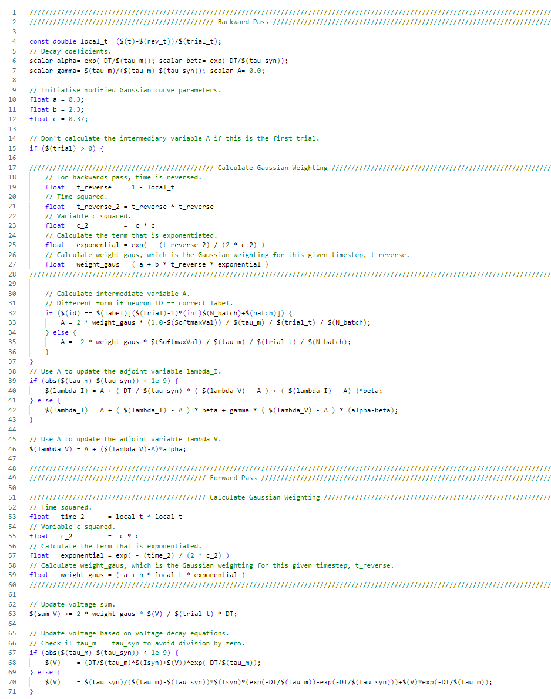{#fig:code_of_evp fig-align=center width="600px"}

To test this Eventprop scheme, a model is trained for 300 epochs, and the best version of the model is saved. Then the saved model is tested against completely new data. I also ran it 5 times for a reduced amount of epochs, 100, along with the old loss function. This is to compare the learning rate averaged out over 5 runs for statistical significance. 

## Profiling the Power Usage of GPU vs CPU

To compare the performance of a machine learning workflow on a GPU versus a CPU, I conducted a series of tests. The CPU (AMD Ryzen 9 5950X) run was executed  with a batch size of 1. For the GPU (Nvidia RTX 4090), training was performed using seven different batch sizes (1, 2, 4, 8, 16, 32, 64) to evaluate how performance scaled with increased parallelism. During each run, I recorded the power consumption and measured the duration of each epoch. By averaging the power usage and epoch times, I calculated the energy consumed per epoch as the product of average power and average epoch duration. This analysis aimed not only to compare speed, but also to determine whether the GPU offers greater energy efficiency.

{#fig:terminal_view fig-align=center }

# Results

## Reproducing State-Of-The-Art Accuracy

Figrue shows the evaluation correct rate for training of the network running for 300 epochs. The maximum evaluation correct of 91.5% is reached during the 281st epoch. This value matches the value reported in literature [@nowotnyLossShapingEnhances2025]. Then I tested the model which achieved the best evaluation during training on the test data, it achieved 93.3%. This again matched the value reported in literature [@nowotnyLossShapingEnhances2025].  

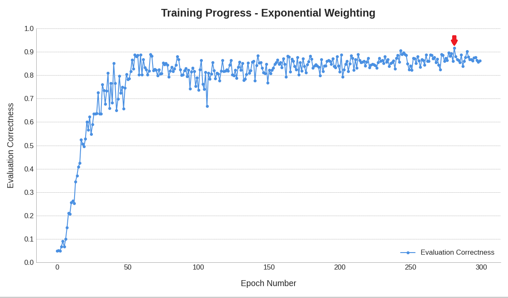{#fig:result_of_exp_simple fig-align=center }

## New Loss Function Improves Training

Figure \ref{fig:result_of_gaus_simple}) shows the training of the new loss function, $\mathcal{L}_{sum\_gaus}$. It too reaches a maximum value of 91.5% during the 300 epochs of training. During the test it reached a slightly lower 92.9%. 

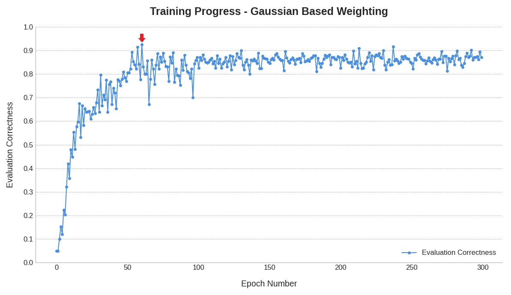{#fig:result_of_gaus_simple fig-align=center }

Figure \ref{fig:gaus_vs_exp_plot}) shows the graph of mean evaluation correct for the first 100 epochs for the Gaussian based loss function end the exponential based loss function, ran 5 times each. It can be seen that the Gaussian learning rate is much faster in the beginning. 

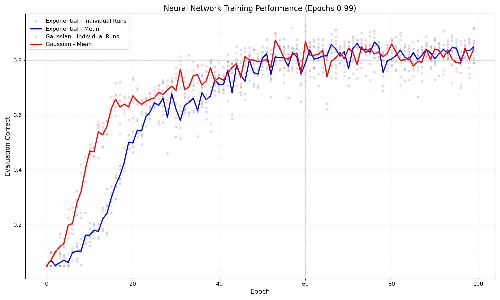{#fig:gaus_vs_exp_plot fig-align=center width="600px"}

## Power Usage of GPU and CPU

The figure \ref{fig:time_and_energy_cost}) presents the time and energy consumption per epoch for each setup on a logarithmic scale. The CPU, processing a single batch, was over 10 times slower than the GPU. While the CPU consumed less power, its substantially longer runtime led to greater overall energy usage. Increasing the batch size improved GPU speed up to a batch size of 32, beyond which performance declined. This data allowed me to optimise training times. 

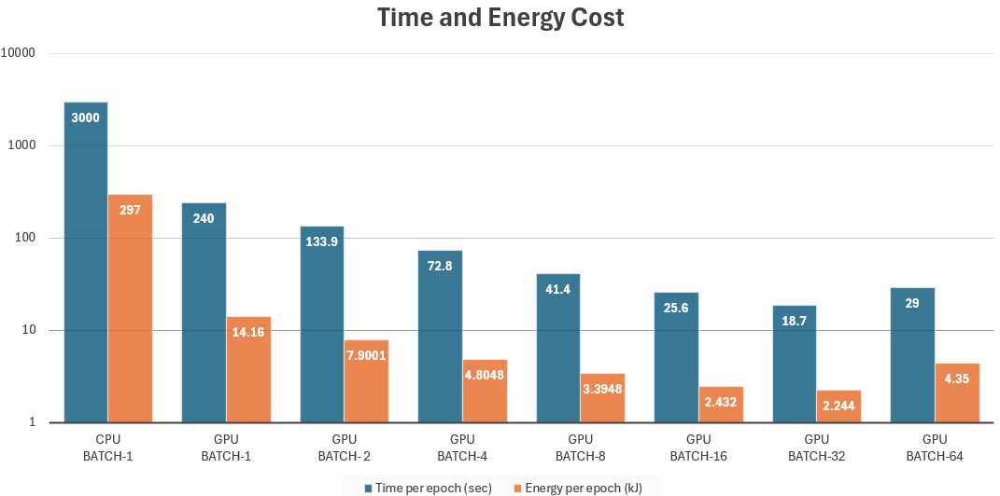{#fig:time_and_energy_cost fig-align=center width="600px"}

# Discussion

This project addressed the challenge of training Spiking Neural Networks (SNNs) for speech recognition, with a focus on the EventProp algorithm - a promising approach for learning in temporal spiking domains. In the initial phase, I successfully reproduced state-of-the-art performance on the Spiking Heidelberg Digits (SHD) dataset, achieving a test accuracy of 93.3% using the established exponentially weighted loss function ($L_{sum\_exp}$). This result serves to validate both the experimental framework and the implementation, establishing a reliable benchmark for assessing subsequent methodological contributions.

The central focus of this investigation was to address a hypothesized sub-optimality in the $\mathcal{L}_{sum\_exp}$ loss function. Specifically, it was posited that the exponential weighting scheme disproportionately amplified noise arising from early, potentially uninformative spikes at the beginning of input sequences. To mitigate this effect, a novel Gaussian-based loss function, $L_{sum\_gaus}$​, was mathematically derived and implemented. This formulation attenuates the influence of both early and late spikes, thereby concentrating the learning signal on temporally central segments of the input, which are assumed to be more informative for speech recognition.

The application of the $\mathcal{L}_{sum\_gaus}$ loss function resulted in a peak test accuracy of 92.8%. Although this is marginally lower than the 93.3% achieved using $\mathcal{L}_{sum\_exp}$, it remains within the error bounds of the state-of-the-art benchmark. Notably, $\mathcal{L}_{sum\_gaus}$ exhibited a substantially faster initial learning rate, as shown in Figure 22. This rapid early convergence suggests that the Gaussian weighting effectively directed the network toward salient features more efficiently—supporting the hypothesis that it reduces the influence of early, noise-driven transients. In practical terms, the improved learning rate offers the potential for shorter training durations and decreased computational cost, providing a meaningful advantage in iterative model development and hyperparameter tuning.

Though slight, the deficit in the final accuracy warrants careful consideration. The factors, including uncertainties and incompleteness in the current work, which could contribute to this observation:

- Hyperparameter optimisation. The hyperparameters, including those defining the network learning rate, and neuron dynamics, were systematically optimised for the $\mathcal{L}_{sum\_gaus}$ loss function [@nowotnyLossShapingEnhances2025]. For the training of $\mathcal{L}_{sum\_gaus}$​ this established hyperparameter set was adopted without modification. Therefore the full potential of $\mathcal{L}_{sum\_gaus}$ may only be realised after a dedicated and systematic hyperparameter optimisation. This was beyond the scope of this project, but offers routes for future research. 
- Inherent stochasticity. Neural network training is subject to inherent randomness. While the learning rate comparison was averaged over five runs, the final SOTA comparison was based on a single extended run for each loss function. The 0.5% difference in peak accuracy is relatively small and could, to some extent, be influenced by this stochasticity. More extensive runs would be needed to establish the statistical significance of this minor difference with greater confidence.

The effect of these uncertainties on project outcomes is that while the novel loss function has demonstrated a clear advantage in learning speed, its capacity to achieve or surpass existing SOTA accuracy on the SHD dataset remains an incompletely answered question, primarily due to the limited hyperparameter exploration

Another avenue for exploration is the application of Eventprop and these loss functions to significantly larger SNN models. The current study utilized a model with a single hidden layer of 512 neurons. Eventprop's inherent computational and memory efficiency is documented to allow for scaling to more complex tasks and larger models, a domain that holds potential for further accuracy improvements but has not yet been fully investigated. Testing how both the $\mathcal{L}_{sum\_exp}$​ and the novel ​ $\mathcal{L}_{sum\_gaus}$ perform with deeper or wider architectures, or those incorporating more complex connectivity patterns, is a critical next step. 

Despite the uncertainties, the engineering achievement of this project is significant. It successfully progressed from a theoretical critique of an existing SOTA method to the mathematical derivation (Section 3.4), software implementation (Section 3.5, Figure 18), and empirical validation of a novel alternative. The demonstration that thoughtful loss function design can directly and positively influence SNN training dynamics is a valuable contribution. This reinforces the principle that model performance is an interplay of architecture, optimisation, and the precise formulation of the learning objective. The power profiling results (Section 4.3, Figure 23) also provided a practical perspective, underscoring the substantial energy and time efficiencies achievable with GPU acceleration in SNN training workflows.

# Conclusion

In conclusion this project aimed to explore training of SNNs for speech recognition tasks. The investigation successfully reproduced the SOTA test accuracy of Eventprop on the SHD dataset using the exponentially weighted loss function $\mathcal{L}_{sum\_exp}$, thereby validating the experimental setup. The core contribution was the mathematical derivation and software implementation of a novel Gaussian-based loss function, $\mathcal{L}_{sum\_gaus}$, designed to mitigate the impact of uninformative early spikes and overemphasised late spikes. When evaluated, the novel loss function achieved a test accuracy of 92.9%. While marginally lower than the SOTA benchmark, a key finding was that $\mathcal{L}_{sum\_gaus}$ exhibited a substantially faster initial learning rate. This rapid early convergence supports the hypothesis that the Gaussian weighting effectively directs the network towards salient features more efficiently by reducing the influence of early, noise-driven transients. This characteristic offers practical advantages, including the potential for shorter training durations and decreased computational costs in model development. 

The slight deficit in the final accuracy achieved by $\mathcal{L}_{sum\_gaus}$ compared to $\mathcal{L}_{sum\_exp}$ warrants consideration. This could be attributed to the adoption of hyperparameters optimised for $\mathcal{L}_{sum\_exp}$ and the inherent stochasticity of neural network training. 

In summary, this project successfully developed and validated a novel loss function that demonstrably improves the initial learning speed of SNNs trained with Eventprop. This work contributes to the ongoing effort to create more efficient and robust training methodologies for SNNs, paving the way for their broader application in low-power, real-time speech processing and other temporal machine learning tasks. The engineering achievement of progressing from a theoretical critique to the mathematical derivation, software implementation, and empirical validation of this novel approach is significant, reinforcing the principle that careful design of the learning objective is crucial for advancing neural network performance.

# Project Review

Overall, the project progressed successfully. Despite facing personal challenges and losses during the semester, I am proud of what I was able to accomplish. A key strength was the time dedicated to understanding the mathematical foundations of the EventProp algorithm, which was really fun, and allowed for a deeper grasp of its underlying principles. The recent publication of the paper achieving state-of-the-art accuracy further motivated me, as it presented an opportunity to contribute novel insights. In retrospect, one area for improvement would have been to continuously run experiments to gather more data. Network interruptions posed a setback by causing training sessions to restart; incorporating checkpointing earlier in the process would have mitigated this issue and ensured greater resilience in the training workflow.

{#fig:gpu_father fig-align=center width="400px"}

# Acknowledgments 

I would like to extend my sincere thanks to my supervisor, Dorian, for his invaluable guidance and support throughout this project. His insights greatly deepened my understanding of spiking neural networks, and I have thoroughly enjoyed our discussions—both about this project and beyond.
A heartfelt thank you also goes to my father, who generously set up and maintained remote access to a GPU at his home, ensuring stable network conditions and managing the firewall and LAN. His support was instrumental in enabling the computational experiments required for this project.
Finally, I extend my deepest gratitude to my fiancée for her support throughout this semester, and throughout university. Her patience and understanding — especially during the many long nights of work — have been invaluable, and I am truly grateful for her encouragement every step of the way.

